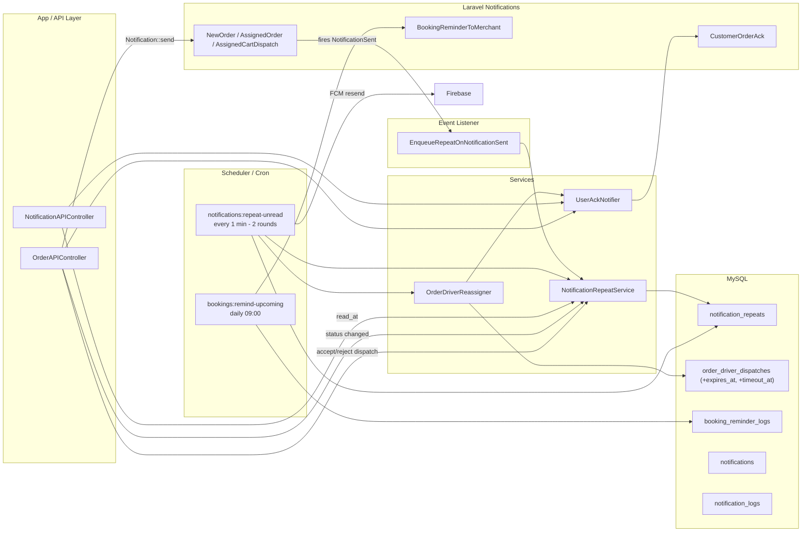
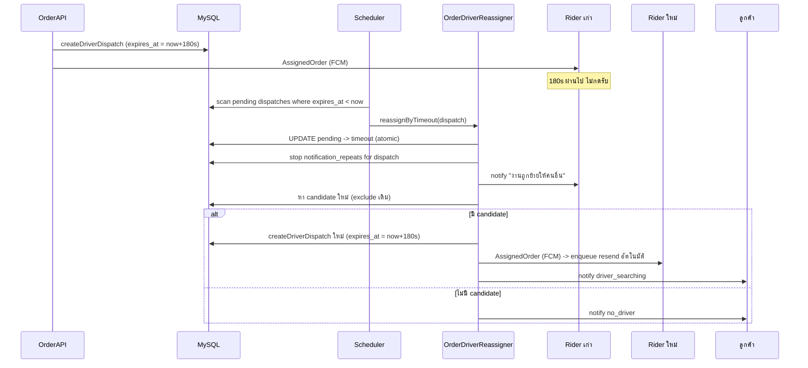

# TOKO — Notification Resend & Auto-Reassign Operation Guide

> **เวอร์ชัน:** 2026-05-07
> **ขอบเขต:** toko-server-v2 (Laravel 5.8) — ระบบส่งซ้ำการแจ้งเตือน, Auto-reassign คนขับ, Acknowledgement กลับลูกค้า, Booking Reminder
> **เป้าหมาย:** ให้ทีมเห็นภาพรวมก่อน Deploy

---

## 1. ภาพรวมระบบ (What changed)

ก่อนหน้านี้ TOKO ยิง notification “ครั้งเดียว” ถ้าผู้รับไม่เห็น/ไม่กดอ่าน -> งานหลุด
ระบบใหม่นี้แก้ปัญหาโดย:

1. **Resend ทุก 30 วินาที** จนกว่าผู้รับจะอ่าน/ตอบรับ หรือครบ max attempts
2. **Auto-reassign คนขับ** เมื่อ dispatch หมดเวลา (180 วินาที)
3. **แจ้ง rider เก่า** ว่างานถูกย้ายไปคนอื่นแล้ว
4. **Acknowledge ลูกค้า** ทุก milestone: ร้านเห็นแล้ว / ร้านรับแล้ว / ไรเดอร์รับแล้ว / กำลังหาไรเดอร์ใหม่ / ไม่มีไรเดอร์ว่าง
5. **เตือน merchant ก่อนถึงวันจอง** 1 วัน + เช้าวันจอง (Hotel/Service) ผ่าน Notification + Email

---

## 2. สถาปัตยกรรม (Architecture)

```{=latex}
\begin{landscape}
\begin{center}
```



```{=latex}
\end{center}
\end{landscape}
```

---

## 3. ตารางฐานข้อมูลที่เพิ่ม

### 3.1 `notification_repeats` (คิวส่งซ้ำ)

| Column | Type | Note |
|---|---|---|
| id | bigInt | PK |
| notification_id | uuid | FK ไปที่ `notifications.id` (สำหรับ stop เมื่อ user อ่าน) |
| user_id | bigInt | ผู้รับ |
| market_id | bigInt nullable | ร้านที่เกี่ยว |
| kind | varchar(50) | เช่น `new_order_dinein`, `assigned_order_rider`, `hotel_booking` |
| order_id | bigInt nullable | |
| dispatch_id | bigInt nullable | FK `order_driver_dispatches` |
| bookable_type / bookable_id | string / bigInt | สำหรับ booking (hotel/service) |
| title / body / data(json) | | payload สำหรับ resend |
| status | varchar | `active` / `stopped` / `expired` |
| stop_reason | string | เหตุผลที่หยุด เช่น `read`, `accepted`, `timeout`, `max_attempts` |
| send_count / max_attempts | int | นับรอบส่ง |
| interval_seconds | int | default 30 |
| last_sent_at / next_send_at / expires_at | datetime | |

### 3.2 `order_driver_dispatches` (เพิ่มคอลัมน์)

| Column | Type | Note |
|---|---|---|
| expires_at | datetime nullable | เซ็ต `now()+180s` ตอน dispatch ใหม่ |
| timeout_at | datetime nullable | เซ็ตเมื่อ reassigner ตัดทิ้ง |
| reassigned_from_dispatch_id | bigInt nullable | trace ลูกโซ่ |

### 3.3 `booking_reminder_logs` (กันส่งซ้ำ)

| Column | Type | Note |
|---|---|---|
| bookable_type | string | `MarketTableBooking` |
| bookable_id | bigInt | |
| kind | enum-like | `day_before` / `day_of` |
| user_id | bigInt | merchant ที่รับ |
| sent_at | datetime | |
| **UNIQUE** | (bookable_type, bookable_id, kind, user_id) | |

---

## 4. การตั้งค่าก่อน Deploy

### 4.1 Cron / Scheduler
ตรวจให้แน่ใจว่ามี cron entry บนเครื่อง production:
```cron
* * * * * cd /var/www/toko-server-v2 && php artisan schedule:run >> /dev/null 2>&1
```

> ระบบเดิมก็ใช้ scheduler อยู่แล้ว (wallet:process-jobs, earning:release-pending) — ถ้ามีอยู่แล้วไม่ต้องเพิ่ม

### 4.2 ENV / Firebase
ใช้ `FirebaseService` เดิม — ไม่ต้องตั้งค่าใหม่
- ตรวจ `firebase-credentials.json` มีอยู่และอ่านได้
- กรณี environment เก่ายังใช้ legacy server key ก็ยังใช้ได้

### 4.3 Email สำหรับ Booking Reminder
- ใช้ `mail` driver เดิมที่ตั้งใน `.env` (`MAIL_*`)
- merchant user ต้องมี `email` ใน DB ถึงจะส่ง email (ไม่มี ก็ส่งเฉพาะ FCM + database)

### 4.4 Flutter Channel ID (SuperApp)
ฝั่ง toko_superapp_5 ต้องมี notification channel:
- `toko_customer_channel_v1` — สำหรับ Acknowledgement กลับลูกค้า

ถ้ายังไม่มี ให้เพิ่มที่ AndroidManifest / native code (เหมือนที่มี `toko_merchant_channel_v2` อยู่แล้ว)

---

## 5. ขั้นตอน Deploy (Runbook)

```bash
# 1) Pull code
cd /var/www/toko-server-v2
git pull

# 2) ติดตั้ง dependencies (ไม่มี package ใหม่ แต่กันเหนียว)
composer install --no-dev --optimize-autoloader

# 3) Migrate (เพิ่ม 3 ตาราง)
php artisan migrate --force

# 4) Cache เคลียร์ (กัน config/route cache เก่า)
php artisan config:clear
php artisan route:clear
php artisan cache:clear

# 5) (ถ้าใช้ supervisor / queue worker / scheduler) restart
sudo supervisorctl restart all
```

### ตรวจหลัง Deploy

```bash
# A) ตรวจ migrations ขึ้นครบ
php artisan migrate:status | grep -E "notification_repeats|booking_reminder|order_driver_dispatches"

# B) ตรวจ command ขึ้น
php artisan list | grep -E "notifications:repeat-unread|bookings:remind-upcoming"

# C) Smoke test ครั้งเดียว
php artisan notifications:repeat-unread --once --limit=10
php artisan bookings:remind-upcoming --dry-run
```

ผลที่คาดหวัง:
```
Firebase initialized with service account file
[2026-05-07 22:16:04] resend=0 reassign=0
```

---

## 6. การทำงานของ Background Jobs

### 6.1 `notifications:repeat-unread` (every minute)

| รอบ | เวลา (วินาทีที่) | งานที่ทำ |
|---|---|---|
| 1 | 0 | resend FCM + sweep dispatch timeout |
| sleep | 0–30 | รอ |
| 2 | 30 | resend FCM + sweep dispatch timeout |

ผลคือ resend ได้ "ทุก 30 วินาที" ทั้งที่ Laravel scheduler รองรับขั้นต่ำ everyMinute

### 6.2 `bookings:remind-upcoming` (daily 09:00)

- หา `MarketTableBooking` ที่ `booking_date` = วันพรุ่งนี้ -> ส่ง `day_before`
- หา `MarketTableBooking` ที่ `booking_date` = วันนี้ -> ส่ง `day_of`
- ส่งให้ทุก user ที่ผูกกับ market นั้น (`user_markets`)
- กันส่งซ้ำด้วย unique index บน `booking_reminder_logs`

---

## 7. Per-kind Defaults (Resend Policy)

| kind | interval | max_attempts | รวมเวลา |
|---|---|---|---|
| `new_order_dinein` | 30s | 20 | ~10 นาที |
| `new_order_pickup` | 30s | 20 | ~10 นาที |
| `new_order_delivery_merchant` | 30s | 20 | ~10 นาที |
| `assigned_order_rider` | 30s | 6 | ~3 นาที (= dispatch timeout 180s) |
| `hotel_booking` | 30s | 30 | ~15 นาที |
| `service_booking` | 30s | 30 | ~15 นาที |
| `field3_order` | 30s | 20 | ~10 นาที |
| `field45_order` | 30s | 20 | ~10 นาที |

ปรับได้ที่ `App\Services\NotificationRepeatService::kindDefaults()`

---

## 8. Stop Conditions (เมื่อไหร่หยุดส่งซ้ำ)

| สถานการณ์ | ตำแหน่งใน code | reason |
|---|---|---|
| User อ่าน notification | `NotificationAPIController@update` (read_at) | `read` |
| ร้านรับ order (เปลี่ยน status) | `OrderAPIController@update` | `accepted_by_merchant` |
| ไรเดอร์กด accept | `OrderAPIController@acceptDriverDispatch` | `driver_accepted` |
| ไรเดอร์กด reject | `OrderAPIController@rejectDriverDispatch` | `driver_rejected` |
| Dispatch หมดเวลา 180s | `OrderDriverReassigner::reassignByTimeout` | `timeout` |
| ครบ max_attempts | consumer command | `max_attempts` |
| `expires_at` หมด | consumer command | `expired` |
| Order ปิด/ยกเลิก | `stopForOrder()` | `accepted_by_merchant` (ขยายต่อได้) |

---

## 9. Acknowledgement Notifications (ที่ลูกค้าจะได้รับเพิ่ม)

ทุก event ส่งเป็น `database + fcm` channel ผ่าน `CustomerOrderAck`:

| event | trigger | ตัวอย่างข้อความ |
|---|---|---|
| `merchant_seen` | ร้านอ่าน noti | "ร้านค้าเห็นออเดอร์ #123 ของคุณแล้ว" |
| `merchant_accepted` | ร้านเปลี่ยน order_status | "ร้านค้ารับออเดอร์ #123 และเริ่มเตรียมแล้ว" |
| `driver_seen` | ไรเดอร์อ่าน noti | "ไรเดอร์เห็นออเดอร์ #123 ของคุณแล้ว" |
| `driver_accepted` | ไรเดอร์ accept dispatch | "ไรเดอร์ {ชื่อ} กำลังจะไปรับออเดอร์ #123" |
| `driver_searching` | reject / reassign สำเร็จ | "ระบบกำลังหาไรเดอร์ใหม่ให้กับออเดอร์ #123" |
| `no_driver` | reject / reassign ไม่เจอ candidate | "ขณะนี้ยังไม่มีไรเดอร์ว่างสำหรับออเดอร์ #123 ระบบจะลองอีกครั้ง" |
| `reassigned_to_other` | rider เก่า ตอน timeout | "ออเดอร์ #123 ถูกมอบหมายให้ไรเดอร์ท่านอื่น" |

> ฝั่ง SuperApp ควรจัดการ event แต่ละชนิดเพื่อแสดง UI ให้เหมาะสม (toast / badge / sound)

---

## 10. Auto-Reassign Flow (Driver Dispatch Timeout)

```{=latex}
\begin{landscape}
\begin{center}
```



```{=latex}
\end{center}
\end{landscape}
```

---

## 11. Monitoring / Troubleshooting

### Logs
- `storage/logs/notifications-repeat.log` — output ของ consumer command
- `storage/logs/booking-reminders.log` — output ของ booking command
- `storage/logs/laravel.log` — error / warning ทั่วไป

### Quick checks (SQL)

```sql
-- คิว resend ที่ยัง active วันนี้
SELECT kind, status, COUNT(*) FROM notification_repeats
WHERE created_at >= CURDATE()
GROUP BY kind, status;

-- Dispatch ที่กำลังจะ timeout ใน 1 นาทีข้างหน้า
SELECT id, order_id, driver_id, expires_at FROM order_driver_dispatches
WHERE status='pending' AND expires_at BETWEEN NOW() AND NOW()+INTERVAL 60 SECOND;

-- Booking reminders ที่ส่งวันนี้
SELECT kind, COUNT(*) FROM booking_reminder_logs
WHERE DATE(sent_at) = CURDATE() GROUP BY kind;

-- เช็ก resend logs
SELECT notification_type, status, method, COUNT(*) FROM notification_logs
WHERE method LIKE 'repeat:%' AND created_at >= NOW()-INTERVAL 1 HOUR
GROUP BY notification_type, status, method;
```

### อาการ / สาเหตุ

| อาการ | สาเหตุที่เป็นไปได้ | วิธีแก้ |
|---|---|---|
| ไม่ resend เลย | scheduler ไม่ทำงาน | ตรวจ cron entry, log `schedule:run` |
| Resend แล้วแต่ FCM ไม่ถึง | token หมดอายุ / channel id ไม่ตรง | ตรวจ `user_device_tokens.is_active`, channel id ฝั่ง app |
| Reassign แล้วได้ rider เดิม | exclude list ผิด | ตรวจ `order_driver_dispatches.driver_id` ของ order/cart นั้น |
| Booking reminder ส่งซ้ำ 2 ครั้ง | unique index ไม่ถูกสร้าง | `SHOW INDEX FROM booking_reminder_logs` |
| Customer ไม่เห็น ack | channel `toko_customer_channel_v1` ฝั่ง app ไม่มี | สร้าง channel ฝั่ง Flutter |

---

## 12. Rollback Plan

ถ้าหลัง deploy พบปัญหา:

```bash
# 1) ปิด scheduler entries (ลบ/comment สอง command ใน app/Console/Kernel.php)
#    notifications:repeat-unread, bookings:remind-upcoming
#    หรือใช้ feature flag (ถ้าเพิ่ม)

# 2) Revert code
git revert <commit-hash>
git push

# 3) Optional: drop ตารางใหม่ (ระวัง data loss สำหรับ logs)
php artisan migrate:rollback --step=3
```

ตารางที่เพิ่มใหม่ทั้ง 3 เป็น append-only (ไม่ทับโครงสร้างเดิม) ดังนั้น rollback code อย่างเดียวก็ปลอดภัย

---

## 13. ผลกระทบต่อระบบเดิม (Side effects checklist)

| ส่วน | ผลกระทบ | ระดับ |
|---|---|---|
| `NewOrder::via()` เพิ่ม `'fcm'` | ก่อนหน้านี้ส่งแค่ database — ตอนนี้ยิง FCM ครั้งแรกด้วย | กลาง — ต้องตรวจว่า merchant device token พร้อม |
| `createDriverDispatch` เพิ่ม `expires_at` | dispatch ใหม่จะ auto-timeout 180s | สูง — เปลี่ยนพฤติกรรม dispatch |
| `OrderAPIController@update` ส่ง ack ลูกค้า | ลูกค้าจะได้ noti เพิ่ม | ต่ำ — ดี |
| Notification ใหม่ `CustomerOrderAck` | volume noti เพิ่ม | ต่ำ |
| Booking reminder daily 09:00 | merchant อาจได้ email/noti จำนวนหนึ่ง | ต่ำ |

---

## 14. ไฟล์ที่ต้องเชิญ Reviewer ดู

**Backend (toko-server-v2)**
- `app/Services/NotificationRepeatService.php`
- `app/Services/OrderDriverReassigner.php`
- `app/Services/UserAckNotifier.php`
- `app/Listeners/EnqueueRepeatOnNotificationSent.php`
- `app/Console/Commands/RepeatUnreadNotifications.php`
- `app/Console/Commands/SendBookingReminders.php`
- `app/Notifications/Customer/CustomerOrderAck.php`
- `app/Notifications/BookingReminderToMerchant.php`
- `app/Notifications/NewOrder.php` (เพิ่ม fcm channel)
- `app/Http/Controllers/API/OrderAPIController.php` (stop wiring)
- `app/Http/Controllers/API/NotificationAPIController.php` (stop wiring)
- `app/Console/Kernel.php` (schedule)
- `database/migrations/2026_05_07_120000_*.php` (3 ไฟล์)

**Frontend (ตามมาทีหลัง)**
- toko_superapp_5: handle event `merchant_seen / merchant_accepted / driver_*` ใน NotificationService
- toko_superapp_5: เพิ่ม Android channel `toko_customer_channel_v1`

---

## 15. Sign-off Checklist (ก่อน Production)

- [ ] `php artisan migrate:status` ขึ้นครบ 3 รายการใหม่
- [ ] `php artisan list` พบ 2 commands ใหม่
- [ ] Cron `* * * * * php artisan schedule:run` ทำงาน (ตรวจ `schedule:list` หรือ log)
- [ ] Smoke test resend command ผ่าน (`--once` ได้ผลลัพธ์ `resend=0 reassign=0`)
- [ ] Smoke test booking command ผ่าน (`--dry-run` แสดง list)
- [ ] ส่ง test order: merchant ได้ noti, ปล่อยทิ้ง 30s ได้รอบสอง
- [ ] ส่ง test order ให้ rider แล้วไม่กด — ภายใน ~3 นาทีต้อง reassign
- [ ] ลูกค้าได้ ack noti ครบ flow
- [ ] Channel `toko_customer_channel_v1` ฝั่ง SuperApp พร้อม
