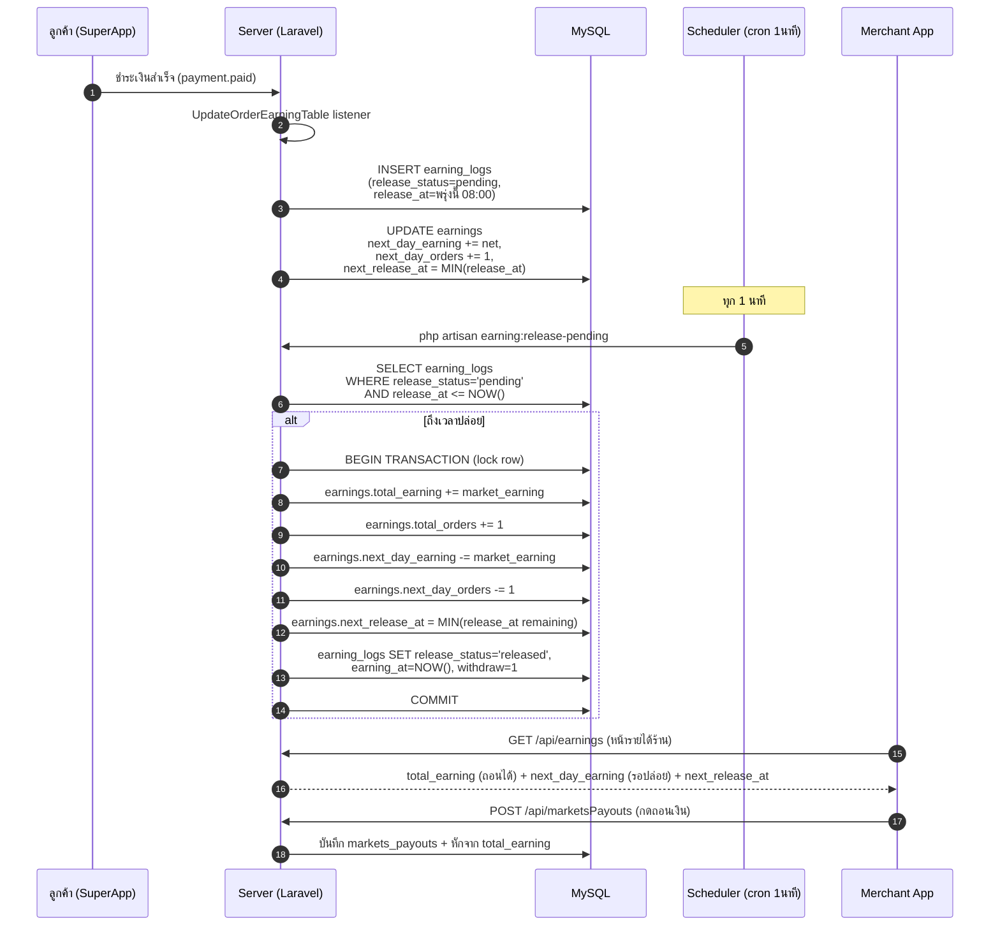

\newpage

# 1. ภาพรวมระบบ (Overview)

ระบบ TOKO ประกอบด้วย 3 ส่วนหลัก

| ส่วน | เทคโนโลยี | Repo |
|------|-----------|------|
| Backend API | Laravel 7 + PHP 7.4 (FPM) | `toko-server-v2` |
| Merchant App | Flutter (iOS/Android) | `toko-merchant-v2` |
| SuperApp (ลูกค้า) | Flutter | `toko-app-v2` (branch `toko_superapp_5`) |

**Hosting**

- AWS Elastic Beanstalk (Amazon Linux 2, PHP 7.4 FPM)
- RDS MySQL 5.7 — `tokoprod.ceagkqnxap2h.ap-southeast-1.rds.amazonaws.com:12121` / db `tokodb`
- S3 bucket `tokobucketimg` (รูป/เอกสาร)
- CodeCommit → CodePipeline → Beanstalk (deploy ผ่าน `git push codecommit main`)

**SSH เข้าเครื่อง prod**

```bash
ssh ssm.toko.service
# ใช้ AWS SSM agent (ไม่ต้องเปิด port 22)
```

\newpage

# 2. โครงสร้างไฟล์สำคัญบนเครื่อง prod

| Path | คำอธิบาย |
|------|----------|
| `/var/app/current/` | โค้ด Laravel ปัจจุบัน |
| `/var/app/current/storage/logs/` | log ของ Laravel + scheduler tasks |
| `/opt/elasticbeanstalk/deployment/env` | env file ของ EB (mode `0400 root:root`) |
| `/etc/cron.d/laravel-scheduler` | cron entry สำหรับรัน `schedule:run` ทุกนาที |
| `/var/log/laravel-scheduler.log` | output ของ `php artisan schedule:run` |
| `/var/log/php-fpm/www-error.log` | output ของ `error_log()` ใน PHP code |

\newpage

# 3. Scheduler & Cron

## 3.1 ภาพรวม

Scheduler รันผ่าน cron ทุกนาที โดยเรียก `php artisan schedule:run` ซึ่งจะตัดสินใจว่ามี task ไหนถึงเวลาทำงานบ้าง (กำหนดใน `app/Console/Kernel.php`)

## 3.2 Tasks ที่กำหนดไว้

| Command | ความถี่ | วัตถุประสงค์ | Log file |
|---------|---------|-------------|----------|
| `wallet:process-jobs` | ทุก 1 นาที | ประมวลผล wallet inquiry queue | `storage/logs/wallet-jobs.log` |
| `earning:release-pending` | ทุก 1 นาที | โยกรายได้ `pending` → `released` เมื่อถึงเวลา | `storage/logs/earning-release.log` |
| `booking:auto-cancel-expired` | ทุก 1 นาที | ยกเลิกการจองโต๊ะที่หมดเวลารอ | `storage/logs/booking-auto-cancel.log` |

ทุก task ใช้ `withoutOverlapping()` กันรันซ้อน

## 3.3 Cron entry มาตรฐาน

```cron
# /etc/cron.d/laravel-scheduler
SHELL=/bin/bash
PATH=/usr/local/bin:/usr/bin:/bin
* * * * * root bash -lc 'set -a; . /opt/elasticbeanstalk/deployment/env; set +a; \
  cd /var/app/current && sudo -E -u webapp php artisan schedule:run' \
  >> /var/log/laravel-scheduler.log 2>&1
```

> **สำคัญ:** ต้องรัน cron เป็น `root` เพราะ `/opt/elasticbeanstalk/deployment/env` อ่านได้เฉพาะ root จากนั้นค่อย `sudo -E -u webapp` เพื่อให้ artisan รันด้วย user ที่เป็นเจ้าของไฟล์ใน `storage/`
> ถ้ารันเป็น `webapp` ตรง ๆ → source env ไม่ได้ → DB fallback เป็น `localhost` → ทุก task fail ด้วย `SQLSTATE[HY000] [2002] Connection refused`

## 3.4 ใครเป็นคน install cron นี้

ทุกครั้งที่ EB deploy เสร็จ จะรัน hook:

```
.platform/hooks/postdeploy/03_install_scheduler_cron.sh
```

ซึ่งจะ regenerate ไฟล์ `/etc/cron.d/laravel-scheduler` และ reload `crond` อัตโนมัติ → instance ใหม่จาก auto-scaling จะได้ cron ที่ถูกต้องตั้งแต่บูต

\newpage

# 4. Flow การโยกเงิน (Earnings Release Flow)

## 4.1 Concept

รายได้ของร้านค้าแบ่งเป็น 2 ก้อน

| ก้อน | ฟิลด์ใน `earnings` | ความหมาย |
|------|--------------------|----------|
| รายได้ถอนออกได้ | `total_earning` | ใช้กดถอนได้ทันที |
| รายได้รอปล่อย (T+1) | `next_day_earning` | ออเดอร์ใหม่ที่ยังไม่ถึงเวลาปล่อย |

แต่ละออเดอร์จะถูกบันทึก 1 record ในตาราง `earning_logs` ด้วย `release_status = pending` และ `release_at = วันถัดไป 08:00` (Asia/Bangkok)

## 4.2 ขั้นตอน end-to-end



## 4.3 ตารางที่เกี่ยวข้อง

### `earning_logs`

| คอลัมน์ | ประเภท | ความหมาย |
|---------|--------|----------|
| `market_id` | int | ร้านค้าเจ้าของรายได้ |
| `order_id` | string | reference ไปยังออเดอร์ |
| `order_paid_at` | datetime | เวลาที่ลูกค้าจ่ายเงิน |
| `release_at` | datetime | กำหนดเวลาที่จะปล่อยเงินก้อนนี้ |
| `release_status` | enum | `pending` / `released` |
| `earning_at` | datetime | เวลาที่ปล่อยเงินจริง (cron set) |
| `order_amount` | decimal | ยอดเต็มของออเดอร์ |
| `commission_rate` | decimal | % commission ที่หัก |
| `commission_amount` | decimal | จำนวนเงินที่หัก |
| `market_earning` | decimal | ยอด net ที่ร้านได้รับ |
| `withdraw` | tinyint | 1 = นับเข้า total_earning แล้ว |

### `earnings` (สรุป per-market)

| คอลัมน์ | ความหมาย |
|---------|----------|
| `total_earning` | ยอดสะสม "ถอนได้" |
| `total_orders` | จำนวนออเดอร์ที่ปล่อยแล้ว |
| `next_day_earning` | ยอดรอปล่อย |
| `next_day_orders` | จำนวนออเดอร์รอปล่อย |
| `next_release_at` | เวลาที่ใกล้ที่สุดที่จะมีการปล่อยรอบถัดไป |

## 4.4 กฎการคำนวณ `release_at`

```php
// app/Listeners/UpdateOrderEarningTable.php :: calculateNextReleaseAt()
$paidAt
  ->setTimezone('Asia/Bangkok')
  ->startOfDay()
  ->addDay()
  ->setTime(8, 0, 0);
```

= **08:00 ของวันถัดไป** หลังจากเวลาที่ลูกค้าชำระเงินเสร็จ

\newpage

# 5. Operation Procedures (วิธีปฏิบัติ)

## 5.1 ตรวจสอบสถานะ scheduler

```bash
ssh ssm.toko.service '
  echo "=== Cron file ===";   sudo cat /etc/cron.d/laravel-scheduler
  echo; echo "=== Last 10 scheduler runs ==="; sudo tail -10 /var/log/laravel-scheduler.log
  echo; echo "=== Earning release log ===";    sudo tail -20 /var/app/current/storage/logs/earning-release.log
  echo; echo "=== Wallet jobs log ===";        sudo tail -20 /var/app/current/storage/logs/wallet-jobs.log
'
```

ผลลัพธ์ที่ถูกต้อง

- บรรทัด cron ขึ้นต้นด้วย `* * * * * root bash -lc ...`
- earning-release log แสดง `Released N pending earning movement(s).` หรือไม่มี exception
- ไม่พบ `Permission denied` หรือ `SQLSTATE[HY000] [2002] Connection refused`

## 5.2 รันโยกเงินด้วยมือ (catch-up หลัง cron พัง)

```bash
ssh ssm.toko.service "sudo bash -c '
  set -a; . /opt/elasticbeanstalk/deployment/env; set +a
  cd /var/app/current && sudo -E -u webapp php artisan earning:release-pending
'"
```

ผลลัพธ์: `Released N pending earning movement(s).`

## 5.3 ตรวจสอบรายได้ร้านใน DB

```sql
-- ดูยอดรวม
SELECT market_id, total_earning, next_day_earning, next_release_at
FROM earnings
WHERE market_id = ?;

-- ดูรายการรายได้ที่ยังไม่ปล่อย
SELECT id, order_id, market_earning, release_at, release_status
FROM earning_logs
WHERE market_id = ? AND release_status = 'pending'
ORDER BY release_at ASC;
```

## 5.4 ดู log error_log() ของ PHP

```bash
ssh ssm.toko.service 'sudo tail -100 /var/log/php-fpm/www-error.log'
```

\newpage

# 6. Troubleshooting

## 6.1 รายได้ค้างไม่ปล่อยหลายวัน

**อาการ:** ยอดในแอปฝั่งร้านโชว์ "รายได้รอปล่อย" สะสมเรื่อย ๆ ไม่โยกเข้า "ถอนได้"

**ขั้นตอนตรวจ**

1. SSH ดู `/var/log/laravel-scheduler.log` — ถ้าเจอ `Permission denied` ของ env file → cron รันเป็น webapp ผิด user ดู §6.2
2. ดู `storage/logs/earning-release.log` — ถ้าเจอ `SQLSTATE[HY000] [2002] Connection refused` → DB env ไม่ถูก source ดู §6.2
3. ถ้า cron ปกติแต่ยอดยังค้าง → query `earning_logs` ดูว่า `release_at > NOW()` (ยังไม่ถึงเวลา) หรือเปล่า

**แก้ปัญหา**

- รัน catch-up ตาม §5.2
- ถ้า cron พัง → ติดตั้ง cron ใหม่ตาม §6.2

## 6.2 Cron ไม่อ่าน DB credentials

**สาเหตุ:** `/opt/elasticbeanstalk/deployment/env` มี permission `0400 root:root` ผู้ใช้ `webapp` อ่านไม่ได้

**Hot-fix บน prod**

```bash
ssh ssm.toko.service "sudo tee /etc/cron.d/laravel-scheduler > /dev/null <<'EOF'
SHELL=/bin/bash
PATH=/usr/local/bin:/usr/bin:/bin
* * * * * root bash -lc 'set -a; . /opt/elasticbeanstalk/deployment/env; set +a; cd /var/app/current && sudo -E -u webapp php artisan schedule:run' >> /var/log/laravel-scheduler.log 2>&1
EOF
sudo chmod 0644 /etc/cron.d/laravel-scheduler
sudo systemctl reload crond"
```

**Permanent fix:** แก้ `.platform/hooks/postdeploy/03_install_scheduler_cron.sh` ให้ install entry นี้แทน (commit ไว้แล้วใน repo)

## 6.3 ยอดถอน / next_day ไม่ตรง

หากเจอเคสยอดเพี้ยน

```sql
-- ตรวจ pending ที่เหลือ vs next_day_earning
SELECT
  e.market_id,
  e.next_day_earning,
  e.next_day_orders,
  COALESCE(SUM(l.market_earning), 0) AS sum_pending,
  COUNT(l.id)                       AS cnt_pending
FROM earnings e
LEFT JOIN earning_logs l
  ON l.market_id = e.market_id AND l.release_status = 'pending'
WHERE e.market_id = ?
GROUP BY e.market_id;
```

ถ้า `next_day_earning != sum_pending` แสดงว่ามี drift → ใช้คำสั่ง `BackfillReleasedEarningLogs` หรือเปิด ticket ให้ทีม backend ตรวจสอบ

\newpage

# 7. Deploy Checklist

- [ ] `git push codecommit main` (CodePipeline จะ deploy ให้)
- [ ] ตรวจ Beanstalk environment กลับเป็น `Health: Ok`
- [ ] รัน §5.1 ดู cron + log หลัง deploy 2-3 นาที
- [ ] ถ้าเปลี่ยน schema: SSH รัน `php artisan migrate --force` (manual)
- [ ] ทดสอบสร้างออเดอร์ → ตรวจ `earning_logs` มี row ใหม่ status `pending`
- [ ] วันถัดไปหลัง 08:00 ตรวจว่า status เปลี่ยนเป็น `released`

\newpage

# 8. Reference

- Source code:
  - `app/Console/Kernel.php` — schedule definition
  - `app/Console/Commands/ReleasePendingEarnings.php` — earning release worker
  - `app/Console/Commands/ProcessWalletJobs.php` — wallet queue worker
  - `app/Console/Commands/AutoCancelExpiredTableBookings.php` — booking auto-cancel
  - `app/Listeners/UpdateOrderEarningTable.php` — สร้าง earning_logs ตอน payment.paid
  - `.platform/hooks/postdeploy/03_install_scheduler_cron.sh` — cron installer
- เอกสารอื่น:
  - `TOKO_Shop_Manual.md` — คู่มือใช้งานสำหรับร้านค้า
