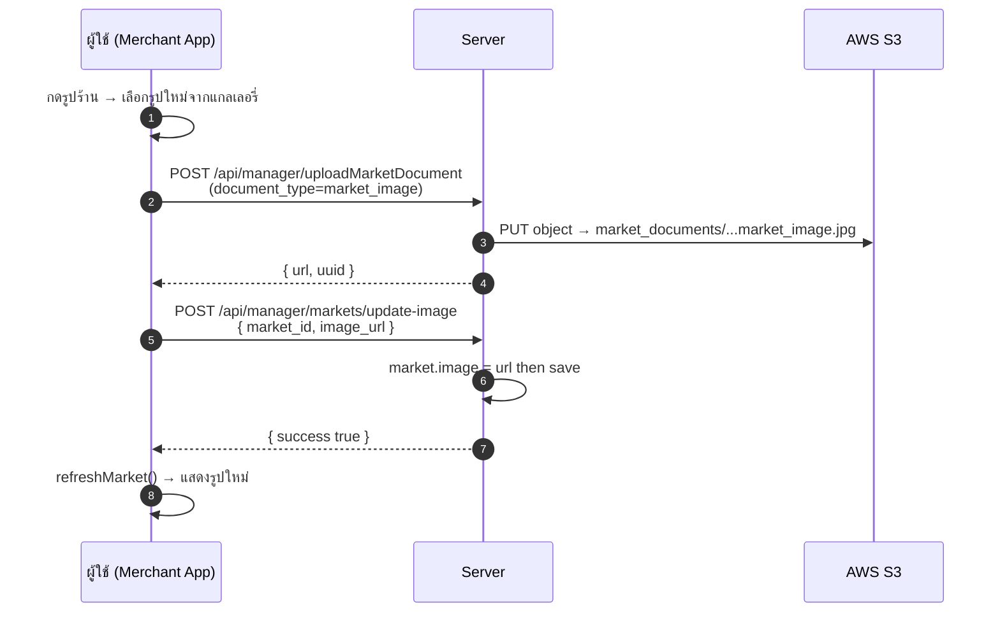
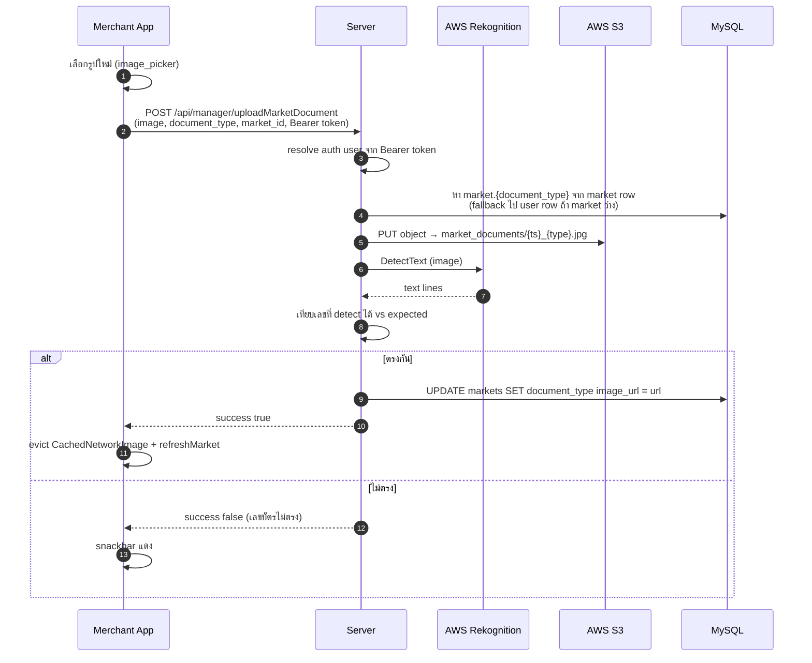
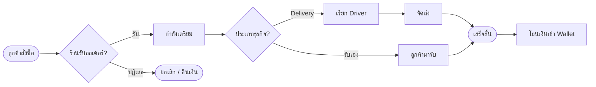

\begin{titlepage}
\thispagestyle{empty}
\begin{center}
\vspace*{1cm}

{\fontsize{56}{60}\selectfont\bfseries\textcolor{tokogreen}{TOKO}}\\[0.2cm]
{\Large\textcolor{tokodark}{SuperApp · Shop Management}}\\[3cm]

\begin{quote}\color{tokogreen}\centering
{\Huge\bfseries\color{white}คู่มือการใช้งาน}\\[0.3cm]
{\Large\color{white}ระบบจัดการร้านค้าสำหรับผู้ประกอบการ}
\end{quote}

\vspace{2.5cm}

{\large\textcolor{tokodark}{\textbf{Merchant Management Manual}}}\\[0.3cm]
{\large\textcolor{midgray}{สำหรับเจ้าของร้านอาหาร โรงแรม ตลาด ร้านขายของชำ}}\\
{\large\textcolor{midgray}{บริการรับส่ง และเซอร์วิสทุกประเภท}}

\vfill

\begin{tabular}{rl}
\textcolor{tokodark}{\textbf{เวอร์ชัน:}} & 2.0 \\[0.2cm]
\textcolor{tokodark}{\textbf{วันที่เผยแพร่:}} & พฤษภาคม 2569 \\[0.2cm]
\textcolor{tokodark}{\textbf{ภาษา:}} & ไทย \\[0.2cm]
\textcolor{tokodark}{\textbf{ระบบที่รองรับ:}} & Android 8.0+ / iOS 13.0+ \\
\end{tabular}

\vspace{1cm}
{\footnotesize\textcolor{midgray}{© 2569 TOKO SuperApp. All rights reserved.}}\\
{\footnotesize\textcolor{midgray}{เอกสารนี้เป็นลิขสิทธิ์ของ TOKO -- ห้ามเผยแพร่โดยไม่ได้รับอนุญาต}}
\end{center}
\end{titlepage}

\newpage
\thispagestyle{empty}
\vspace*{2cm}

\begin{quote}\color{tokogreen}\textbf{\large\color{tokodark}เกี่ยวกับเอกสารฉบับนี้}\\[0.3cm]
คู่มือฉบับนี้จัดทำขึ้นสำหรับ \textbf{ผู้ประกอบการร้านค้า (Merchant)} ที่ต้องการเริ่มต้นใช้งานแพลตฟอร์ม TOKO SuperApp ครอบคลุมตั้งแต่การสมัครสมาชิก การสร้างร้านค้า การจัดการสินค้า การรับคำสั่งซื้อ ไปจนถึงการบริหารพนักงานและรายงาน
\end{quote}

\vspace{0.5cm}

\textbf{\color{tokogreen}กลุ่มเป้าหมาย}
\begin{itemize}
\item เจ้าของร้านอาหาร / โรงแรม / ที่พัก
\item ผู้ให้บริการรับส่ง (Delivery / Logistics)
\item เจ้าของแผงในตลาด / ร้านขายของชำ / ร้านสะดวกซื้อ
\item ผู้ให้บริการเซอร์วิสและแม่บ้าน
\end{itemize}

\textbf{\color{tokogreen}สัญลักษณ์ที่ใช้ในเอกสาร}

\begin{tabular}{ll}
\textcolor{tokogreen}{\textbf{[เคล็ดลับ]}} & คำแนะนำเพื่อใช้งานได้อย่างมีประสิทธิภาพ \\
\textcolor{tokoaccent}{\textbf{[ข้อควรระวัง]}} & สิ่งที่ต้องระวังเป็นพิเศษ \\
\textcolor{midgray}{\textbf{[หมายเหตุ]}} & ข้อมูลเพิ่มเติม \\
\textbf{Fig N.} & รูปประกอบลำดับที่ N \\
\end{tabular}

\textbf{\color{tokogreen}ประวัติการแก้ไข}

\begin{tabular}{lll}
\toprule
\textbf{เวอร์ชัน} & \textbf{วันที่} & \textbf{รายละเอียด} \\
\midrule
1.0 & ม.ค. 2569 & ฉบับเริ่มต้น \\
1.5 & มี.ค. 2569 & เพิ่มบทที่ 8 (Restaurant) \\
2.0 & พ.ค. 2569 & ปรับโครงสร้างใหม่ + เพิ่มบทที่ 9-15 \\
\bottomrule
\end{tabular}

\newpage
\tableofcontents
\newpage

# บทนำ: ก้าวสู่ความสำเร็จทางการค้ายุคใหม่กับ TOKO

ในยุคที่เทคโนโลยีดิจิทัลเข้ามาเป็นส่วนหนึ่งของวิถีชีวิต ระบบ **TOKO Shop** ถูกออกแบบมาเพื่อเป็นเครื่องมืออันทรงพลังที่จะช่วยให้ร้านค้าบริหารจัดการธุรกิจได้อย่างมีประสิทธิภาพ และเข้าถึงลูกค้าได้กว้างขวางยิ่งขึ้น เรามุ่งมั่นที่จะนำเสนอโซลูชันที่ใช้งานง่าย ปลอดภัย และตอบโจทย์ธุรกิจทุกรูปแบบ

คู่มือฉบับนี้จะนำท่านไปทำความเข้าใจกับทุกฟังก์ชันการทำงาน ตั้งแต่การสร้างร้านค้าไปจนถึงการเริ่มต้นรับคำสั่งซื้อ เพื่อให้ท่านมั่นใจได้ว่าการก้าวเข้าสู่แพลตฟอร์มของเราจะเป็นก้าวที่มั่นคงและยั่งยืน

## ภาพรวมแพลตฟอร์ม TOKO

TOKO SuperApp เป็นแพลตฟอร์มแบบ All-in-One ที่รวมบริการหลากหลายไว้ในแอปเดียว:

\begin{tabular}{ll}
\toprule
\textbf{ส่วนประกอบ} & \textbf{หน้าที่} \\
\midrule
TOKO Customer App & แอปสำหรับลูกค้าผู้ใช้บริการ \\
\textbf{TOKO Merchant App} & \textbf{แอปสำหรับร้านค้า (เอกสารนี้)} \\
TOKO Driver App & แอปสำหรับคนขับ/ไรเดอร์ \\
TOKO Admin Console & ระบบหลังบ้านสำหรับผู้ดูแลระบบ \\
\bottomrule
\end{tabular}

## ความต้องการของระบบ

- **Android:** 8.0 (Oreo) ขึ้นไป -- RAM ≥ 2GB
- **iOS:** 13.0 ขึ้นไป -- รองรับ iPhone 7 ขึ้นไป
- **อินเทอร์เน็ต:** 4G/5G/Wi-Fi (แนะนำความเร็ว ≥ 5 Mbps)
- **GPS:** เปิดใช้งานเพื่อปักหมุดตำแหน่งร้าน
- **อุปกรณ์รอบข้าง:** กล้อง (สำหรับสแกน QR และถ่ายเอกสาร)

\newpage

# บทที่ 1: การเข้าใช้งานระบบ (Login)

การเข้าสู่ระบบเป็นขั้นตอนสำหรับร้านค้าที่มีบัญชีผู้ใช้งานอยู่แล้วในระบบ TOKO Shop เพื่อเข้าถึงแผงควบคุมและบริหารจัดการธุรกิจ

<!-- วิธีใส่รูป: นำไฟล์รูปไปวางใน images/ แล้วใช้ syntax ด้านล่าง (ลบ comment ออกได้)
{width=60%}
-->

## 1.1 องค์ประกอบของหน้าเข้าสู่ระบบ

1. **ชื่อผู้ใช้งาน / อีเมล (Username/Email):** ระบุข้อมูลที่ใช้ลงทะเบียน
2. **รหัสผ่าน (Password):** รหัสผ่านส่วนตัวที่ตั้งไว้ตอนสมัคร
3. **ปุ่มเข้าสู่ระบบ (Login):** กดเพื่อตรวจสอบสิทธิ์และเข้าสู่หน้าหลักของร้านค้า
4. **ลิงก์ลืมรหัสผ่าน:** สำหรับขอรีเซ็ตรหัสผ่านผ่านอีเมล
5. **ลิงก์สมัครสมาชิก:** หากยังไม่มีบัญชี สามารถกดเพื่อเข้าสู่หน้าการลงทะเบียนได้ทันที

\begin{tipbox}
\textbf{เคล็ดลับ:} หากใช้งานบ่อย แนะนำให้ตั้งค่า "Biometric Login" (Face ID / Touch ID / ลายนิ้วมือ) ในเมนูตั้งค่า เพื่อเข้าสู่ระบบได้สะดวกและปลอดภัยยิ่งขึ้น
\end{tipbox}

## 1.2 ขั้นตอนการเข้าสู่ระบบ

1. เปิดแอป TOKO Merchant
2. กรอกอีเมลที่ใช้ลงทะเบียน
3. กรอกรหัสผ่าน (กดไอคอนรูปตา  เพื่อแสดงรหัส)
4. กดปุ่ม **Login** สีเขียว
5. ระบบจะนำเข้าสู่หน้าหลัก (Home Screen) อัตโนมัติ

## 1.3 การแก้ปัญหาเข้าระบบไม่ได้

\begin{tabular}{p{6cm}p{8cm}}
\toprule
\textbf{ปัญหา} & \textbf{วิธีแก้ไข} \\
\midrule
ลืมรหัสผ่าน & กด "ลืมรหัสผ่าน"  ->  กรอกอีเมล  ->  ตรวจกล่องจดหมาย \\
รหัสผ่านผิดเกิน 5 ครั้ง & รอ 15 นาที หรือรีเซ็ตรหัสผ่าน \\
อีเมลไม่ถูกต้อง & ตรวจสอบการพิมพ์ หรือสมัครใหม่ \\
แอปค้าง / Login ไม่ขึ้น & ปิดแอป  ->  ล้าง Cache  ->  เปิดใหม่ \\
\bottomrule
\end{tabular}

\begin{figure}[h]
\centering
\includegraphics[width=0.45\textwidth]{images/image1.png}
\caption{หน้าจอเข้าระบบ}
\end{figure}

\newpage

# บทที่ 2: การลงทะเบียนร้านค้าใหม่ (Merchant Registration)

การสมัครสมาชิกเพื่อเป็นพันธมิตรกับ TOKO มีกระบวนการตรวจสอบและรักษาความปลอดภัยที่เข้มงวด เพื่อสร้างความเชื่อมั่นทั้งกับร้านค้าและลูกค้า

## 2.1 การกรอกข้อมูลบัญชีผู้ใช้งาน (Account Setup)

ในขั้นตอนแรก ร้านค้าต้องระบุข้อมูลเพื่อสร้างบัญชีหลัก ได้แก่:

1. **ชื่อผู้ใช้งาน (Username):** สำหรับใช้ระบุตัวตนในระบบ
2. **อีเมล (Email):** ต้องเป็นอีเมลที่ใช้งานได้จริงเพื่อรับรหัสยืนยัน
3. **รหัสผ่าน (Password) และยืนยันรหัสผ่าน:** กำหนดรหัสผ่านที่ปลอดภัยและกรอกให้ตรงกันทั้ง 2 ช่อง
4. **เครื่องหมายยอมรับข้อกำหนดและเงื่อนไข:** อ่านและยอมรับก่อนสมัคร

\begin{warnbox}
\textbf{ข้อควรระวัง -- มาตรฐานรหัสผ่าน:}
\begin{itemize}
\item ความยาวอย่างน้อย 8 ตัวอักษร
\item ประกอบด้วยตัวอักษรพิมพ์ใหญ่-เล็ก ตัวเลข และอักขระพิเศษ
\item ไม่ใช้รหัสซ้ำกับเว็บไซต์อื่น
\end{itemize}
\end{warnbox}

\begin{figure}[h]
\centering
\includegraphics[width=0.45\textwidth]{images/image2.png}
\caption{หน้าจอลงทะเบียน}
\end{figure}

## 2.2 การยืนยันตัวตนผ่านอีเมล (Email OTP)

หลังจากกรอกข้อมูลบัญชีเบื้องต้น ระบบจะยกระดับความปลอดภัยด้วยการตรวจสอบความเป็นเจ้าของอีเมล:

1. **การส่งรหัส:** ระบบจะส่งรหัสตัวเลข **6 หลัก** ไปยังอีเมลที่ท่านระบุไว้
2. **อายุของ OTP:** มีอายุการใช้งาน **10 นาที**
3. **หน้าจอกรอก OTP:** นำตัวเลขมาใส่ในระบบให้ถูกต้องภายในเวลาที่กำหนด
4. **การส่งรหัสซ้ำ:** หากไม่ได้รับ สามารถกด "ส่งอีกครั้ง" ได้หลังจาก 60 วินาที

\begin{tipbox}
หากไม่พบอีเมล กรุณาตรวจสอบ Spam / Junk Folder ก่อนเสมอ
\end{tipbox}

\begin{figure}[h]
\centering
\begin{minipage}{0.45\textwidth}\centering
\includegraphics[width=\linewidth]{images/image3.jpg}\\
\small ตัวอย่างอีเมล OTP
\end{minipage}\hfill
\begin{minipage}{0.45\textwidth}\centering
\includegraphics[width=\linewidth]{images/image4.jpg}\\
\small หน้าจอกรอก OTP
\end{minipage}
\caption{การยืนยันตัวตนผ่านอีเมล (OTP)}
\end{figure}

## 2.3 การตั้งรหัส PIN และการจัดการความปลอดภัย

เมื่อยืนยัน OTP สำเร็จ ระบบจะให้ท่านกำหนดรหัสผ่านสำหรับการใช้งานแบบเร่งด่วน:

1. **การกำหนด PIN:** ตั้งรหัสตัวเลข **6 หลัก** เพื่อใช้ปลดล็อกแอปพลิเคชันและยืนยันธุรกรรมสำคัญ
2. **การเปลี่ยนรหัส PIN:** ปรับเปลี่ยนได้ตลอดเวลาผ่านเมนูการตั้งค่า
3. **การรีเซ็ต PIN:** หากลืม PIN สามารถรีเซ็ตได้ผ่านอีเมลและรหัสผ่านหลัก

\newpage

# บทที่ 3: เมนูหลักและระบบบริหารจัดการ (Bottom Navigation Bar)

หลังจากท่านเข้าสู่ระบบและตั้งค่าร้านค้าเรียบร้อยแล้ว ท่านจะพบกับแถบเมนูหลักด้านล่าง (Navigation Bar) ซึ่งเป็นศูนย์กลางในการควบคุมการทำงานทั้งหมดของร้านค้า โดยแบ่งออกเป็น **5 เมนูหลัก** ดังนี้:

\begin{tabular}{cll}
\toprule
\textbf{ไอคอน} & \textbf{เมนู} & \textbf{หน้าที่หลัก} \\
\midrule
 & Event Management & สร้างและบริหารกิจกรรมพิเศษ \\
 & Store Management & จัดการข้อมูลร้านค้า \\
 & Home & ภาพรวมและออเดอร์ \\
 & Chat & สื่อสารกับลูกค้า \\
 & Booking & จัดการการจอง (โต๊ะ/ห้องพัก) \\
\bottomrule
\end{tabular}

## 3.1 หน้าจัดการอีเวนต์ (Event Management)

เมนูสำหรับการสร้างและบริหารกิจกรรมพิเศษของร้านค้า เพื่อดึงดูดลูกค้าและเพิ่มยอดขาย

- **การสร้างกิจกรรม:** ระบุรายละเอียดอีเวนต์ วันเวลา และสถานที่จัดกิจกรรม
- **การโปรโมต:** ใช้เป็นช่องทางในการแจ้งข่าวสารหรือโปรโมชันเฉพาะกิจ

## 3.2 หน้าจัดการร้านค้า (Store Management)

เปรียบเสมือนกองบัญชาการของร้านค้า ใช้สำหรับดูแลภาพรวมและข้อมูลพื้นฐานทั้งหมด

- **การแก้ไขข้อมูล:** ปรับเปลี่ยนชื่อร้าน รายละเอียด คำบรรยาย หรือรูปภาพหน้าปก
- **การตั้งค่าเวลาทำการ:** กำหนดเวลาเปิด-ปิดร้าน รวมถึงการปิดร้านชั่วคราว
- **พิกัดร้านค้า:** ตรวจสอบและแก้ไขตำแหน่งที่ตั้ง

## 3.3 หน้าจัดการคำสั่งซื้อ (Order Management)

หัวใจสำคัญของการดำเนินธุรกิจ ใช้สำหรับติดตามและจัดการรายการสั่งซื้อแบบ Real-time

- **สถานะคำสั่งซื้อ:** Pending  ->  Processing  ->  Completed
- **การตอบรับ Order:** ระบบแจ้งเตือนเมื่อมีคำสั่งซื้อใหม่

## 3.4 หน้าแชต (Chat System)

ช่องทางสื่อสารโดยตรงระหว่างร้านค้าและลูกค้า

- **การตอบโต้แบบทันที:** ตอบคำถามเกี่ยวกับรายละเอียดสินค้าหรือบริการ
- **ประวัติการสนทนา:** จัดเก็บข้อมูลการคุยกับลูกค้า

## 3.5 หน้าจัดการการจอง (Booking Management)

เมนูเฉพาะสำหรับธุรกิจที่เน้นการให้บริการพื้นที่:

1. **Room Booking (โรงแรม/ที่พัก):** จัดการสถานะห้องว่าง, Check-in/Check-out
2. **Table Booking (ร้านอาหาร):** บริหารจัดการการจองโต๊ะล่วงหน้า

\newpage

# บทที่ 4: หน้าหลัก (Home Screen)

เมื่อท่านผ่านกระบวนการลงทะเบียนและเข้าสู่ระบบด้วยรหัส PIN สำเร็จ ระบบจะนำท่านเข้าสู่ **"หน้าหลัก" (Home Screen)** ซึ่งเปรียบเสมือนศูนย์กลางการควบคุมธุรกิจ (Command Center)

## 4.1 องค์ประกอบของหน้าหลัก

| ส่วน | คำอธิบาย |
|---|---|
| Header | ชื่อร้าน + ไอคอนแจ้งเตือน  |
| Tab Switcher | สลับระหว่างหลายร้านในบัญชีเดียว |
| Order Status Filter | กรองออเดอร์ตามสถานะ |
| Order Card | การ์ดแสดงรายละเอียดออเดอร์ |
| Bottom Nav | แถบเมนูด้านล่าง |

## 4.2 การ์ดออเดอร์ (Order Card)

แต่ละการ์ดประกอบด้วย:

- **เลขที่ออเดอร์** (เช่น #6339)
- **สถานะการชำระเงิน** (จ่ายแล้ว / รอชำระ)
- **วันเวลาที่สั่ง**
- **รูป + ชื่อสินค้า + จำนวน + ราคา**
- **ปุ่มเริ่มเตรียม** (สำหรับ Restaurant)
- **QR Code** สำหรับให้คนขับสแกน
- **ยอดรวม** + ค่าส่ง + ภาษี

\begin{notebox}
\textbf{หมายเหตุ:} หากยังไม่มีร้านในระบบ หน้าหลักจะแสดงข้อความ "คุณยังไม่มีร้าน โปรดลงชื่อเข้าใช้โดยเข้าเป็นผู้ดูแลระบบและเปิดร้านใหม่" พร้อมปุ่ม "เพิ่มร้านค้า" สีส้มที่มุมขวาล่าง
\end{notebox}

\begin{figure}[h]
\centering
\begin{minipage}{0.45\textwidth}\centering
\includegraphics[width=\linewidth]{images/image5.jpg}\\
\small หน้าหลัก (Home Screen)
\end{minipage}\hfill
\begin{minipage}{0.45\textwidth}\centering
\includegraphics[width=\linewidth]{images/image6.jpg}\\
\small กรณีที่ยังไม่สร้างร้าน
\end{minipage}
\caption{หน้าหลักของระบบ}
\end{figure}

\newpage

# บทที่ 5: ประเภทธุรกิจ (Business Type Definitions)

ระบบ TOKO Shop รองรับธุรกิจหลากหลายถึง **6 ประเภทหลัก** เพื่อส่งมอบเครื่องมือการจัดการที่ตรงกับความต้องการของแต่ละธุรกิจ

\begin{tabular}{lll}
\toprule
\textbf{\#} & \textbf{ประเภท} & \textbf{ฟีเจอร์เด่น} \\
\midrule
1 & ร้านอาหาร (Foods) & Table Booking + Menu Management \\
2 & โรงแรม (Hotels) & Room Booking + Check-in/out \\
3 & บริการรับส่ง (T.O.S) & 6-Step KYC + Driver Management \\
4 & ตลาด (Market) & Pin Marker + Multi-stall \\
5 & ร้านขายของชำ (Shop) & Pick \& Pack + SKU Management \\
6 & เซอร์วิสและแม่บ้าน (Service) & Queue + On-site Service \\
\bottomrule
\end{tabular}

\begin{notebox}
ประเภท 1, 2, 4, 5, 6 ใช้ขั้นตอนการลงทะเบียนเหมือนกัน (ฟอร์มเดียว) ส่วนประเภท 3 (บริการรับส่ง) มีขั้นตอนพิเศษ 6 ขั้นตอน
\end{notebox}

## 5.1 ร้านอาหาร (Restaurant)

ธุรกิจที่เน้นการจำหน่ายอาหารและเครื่องดื่มเพื่อบริโภคทันทีหรือจัดส่ง

- **วัตถุประสงค์:** เพื่อบริหารจัดการเมนูอาหาร ราคาสินค้า และการรับคำสั่งซื้อจากลูกค้า
- **ฟีเจอร์เด่น:** รองรับระบบ **Table Booking** เพื่อจัดการลำดับลูกค้าที่ต้องการเข้ามาใช้บริการในร้าน

## 5.2 โรงแรม (Hotel)

ธุรกิจที่ให้บริการที่พักแรมและสิ่งอำนวยความสะดวก

- **วัตถุประสงค์:** เพื่อแสดงประเภทห้องพัก รายละเอียดที่พัก และจัดการตารางการเข้าพัก
- **ฟีเจอร์เด่น:** ระบบ **Room Booking** ตรวจสอบสถานะห้องว่าง (Availability) และจัดการ Check-in/Check-out

## 5.3 บริการรับส่ง (Delivery Service)

ธุรกิจที่ให้บริการขนส่งสินค้า พัสดุ หรือรับส่งผู้โดยสาร

- **วัตถุประสงค์:** เชื่อมต่อระหว่างผู้ส่งและผู้รับผ่านแพลตฟอร์ม
- **ฟีเจอร์เด่น:** ขั้นตอนการลงทะเบียนพิเศษ **6 ขั้นตอน** (เอกสารทะเบียนรถ บัญชีธนาคาร บัตรประชาชน ใบขับขี่) + เมนู **จัดการคนขับ (Driver)**

## 5.4 ตลาด (Market)

ธุรกิจที่มีลักษณะเป็นแผงค้าหรือร้านค้าที่ตั้งอยู่ในพื้นที่ตลาดสด/ตลาดนัด

- **วัตถุประสงค์:** รวมกลุ่มร้านค้าย่อยให้ลูกค้าเข้าถึงได้ง่ายผ่านระบบดิจิทัล
- **ฟีเจอร์เด่น:** เน้นการระบุพิกัดที่ตั้งที่ชัดเจนภายในบริเวณตลาด

## 5.5 ร้านขายของชำ (Grocery Store)

ธุรกิจจำหน่ายสินค้าอุปโภคบริโภค สินค้าใช้ในครัวเรือน หรือร้านสะดวกซื้อ

- **วัตถุประสงค์:** จัดการสต็อกสินค้าที่มีความหลากหลายและจำนวนรายการ (SKU) ที่ค่อนข้างมาก
- **ฟีเจอร์เด่น:** ระบบจัดการคำสั่งซื้อแบบ **Pick & Pack**

## 5.6 เซอร์วิสและแม่บ้าน (Service \& Maid)

ธุรกิจที่เน้นการให้บริการถึงสถานที่ (On-site Service) เช่น ทำความสะอาด ซ่อมบำรุง

- **วัตถุประสงค์:** บริหารจัดการตารางเวลาของผู้ให้บริการ และพิกัดในการเดินทาง
- **ฟีเจอร์เด่น:** ระบบจัดการคิวงานที่ระบุเวลาและตำแหน่งที่ตั้งของลูกค้า

\newpage

# บทที่ 6: ขั้นตอนการสร้างร้านค้าใหม่

หลังจากที่ท่านเข้าสู่ระบบและยืนยันตัวตนเรียบร้อยแล้ว หากท่านยังไม่มีหน้าร้านในระบบ หน้าจอหลักจะแสดงพื้นที่ว่างเพื่อให้ท่านเริ่มต้นสร้างธุรกิจ โดยมีจุดสังเกตหลักคือ **"ปุ่มเพิ่มร้านค้าสีส้ม"** ที่มุมขวาล่าง

\begin{figure}[h]
\centering
\begin{minipage}{0.31\textwidth}\centering
\includegraphics[width=\linewidth]{images/image7.jpg}\\
\small หน้าจอร้านของฉัน
\end{minipage}\hfill
\begin{minipage}{0.31\textwidth}\centering
\includegraphics[width=\linewidth]{images/image8.jpg}\\
\small เลือกประเภทร้าน (1)
\end{minipage}\hfill
\begin{minipage}{0.31\textwidth}\centering
\includegraphics[width=\linewidth]{images/image9.jpg}\\
\small เลือกประเภทร้าน (2)
\end{minipage}
\caption{เริ่มต้นสร้างร้านค้า}
\end{figure}

## 6.1 ขั้นตอนการสร้างร้านค้าสำหรับธุรกิจบริการรับส่ง (ประเภทที่ 3)

เนื่องจากลักษณะธุรกิจเฉพาะทาง จึงมีขั้นตอนการลงทะเบียนรวม **6 ขั้นตอน**:

\begin{tabular}{cll}
\toprule
\textbf{ขั้น} & \textbf{หัวข้อ} & \textbf{ข้อมูลที่ต้องเตรียม} \\
\midrule
1 & Vehicle \& Location & ทะเบียนรถ + พิกัดสแตนด์บาย \\
2 & Bank Account & ชื่อธนาคาร + เลขบัญชี \\
3 & ID Card & รูปบัตรประชาชน + เลขบัตร \\
4 & Driving License & รูปใบขับขี่ + เลขที่ใบขับขี่ \\
5 & Store Metadata & รูปร้าน/ยานพาหนะ \\
6 & Driver Profile & รูปใบหน้าคนขับ \\
\bottomrule
\end{tabular}

## 6.2 ขั้นตอนการสร้างร้านค้าสำหรับธุรกิจประเภท 1, 2, 4, 5, 6

กลุ่มธุรกิจเหล่านี้มีขั้นตอนการลงทะเบียนที่สอดคล้องกันเพื่อความรวดเร็ว:

1. **ข้อมูลพื้นฐาน:** ระบุชื่อและรายละเอียดร้านค้า
2. **ตำแหน่งที่ตั้ง:** ปักหมุดพิกัดร้านค้าเพื่อให้ระบบนำทางและคำนวณระยะทางได้อย่างแม่นยำ
3. **ตรวจสอบผลการลงทะเบียน:** เมื่อดำเนินการเสร็จสิ้น ระบบจะแจ้งผลการอนุมัติร้านค้าทันที

\newpage

# บทที่ 7: กระบวนการเพิ่มร้านค้า (รายละเอียด)

เมื่อท่านผ่านขั้นตอนการลงทะเบียนบัญชีและตั้งรหัส PIN แล้ว ขั้นตอนสำคัญต่อไปคือการ **"เพิ่มร้านค้า"** เพื่อเปิดตัวตนบนแพลตฟอร์ม TOKO

## 7.1 การเริ่มต้นเข้าสู่กระบวนการสร้างร้านค้า

- **จุดเริ่มต้น:** ในหน้าหลัก หากท่านยังไม่มีร้านค้า ให้กดปุ่ม **"เพิ่มร้านค้า"** สีส้ม
- **การจำแนกประเภทธุรกิจ:** ระบบจะให้ท่านเลือก 1 จาก 6 ประเภท
- **เหตุผล:** เพื่อให้ระบบเปิดชุดเครื่องมือ (Feature) ที่ตรงกับความต้องการของธุรกิจ

## 7.2 รายละเอียดหน้าจอการกรอกข้อมูล (Interface \& Object Details)

### 7.2.1 ส่วนข้อมูลโปรไฟล์ร้านค้า (Store Profile Object)

\begin{tabular}{p{4cm}p{10cm}}
\toprule
\textbf{Field} & \textbf{สิ่งที่ต้องทำ / เพื่ออะไร} \\
\midrule
ชื่อร้าน (Store Name) & ชื่อแบรนด์ที่ต้องการให้ลูกค้าเห็น -- ปรากฏในผลค้นหาและใบเสร็จ \\
คำอธิบาย (Description) & แนะนำร้านสั้นๆ เช่น "อาหารไทยรสจัดจ้าน" -- ช่วยลูกค้าตัดสินใจ \\
เบอร์โทรศัพท์ & ติดต่อสอบถาม -- สำหรับเจ้าหน้าที่และลูกค้า \\
\bottomrule
\end{tabular}

### 7.2.2 ส่วนการจัดการพิกัดและพื้นที่ (Location \& Map Object)

- **ปุ่มปักหมุดแผนที่ (Map Picker):** กดเข้าไปที่แผนที่แล้วเลื่อนหมุดไปวางตรงจุดที่ร้านตั้งอยู่จริง -- ใช้คำนวณค่าจัดส่งและส่งข้อมูลให้คนขับ
- **ที่อยู่โดยละเอียด:** บ้านเลขที่ ซอย ถนน แขวง/ตำบล -- ใช้เป็นข้อมูลสำรองในกรณี GPS คลาดเคลื่อน

### 7.2.3 ส่วนการจัดการสื่อ (Media \& Visual Object)

- **รูปภาพหน้าปก (Cover Image):** เปรียบเสมือนป้ายหน้าร้านดิจิทัล
- **แกลลอรี่ (Gallery):** เพิ่มความน่าเชื่อถือและความหลากหลาย

### 7.2.4 ส่วนการกำหนดเวลาทำการ (Operating Hours)

- **เวลาเปิด-ปิด:** ระบบจะใช้ข้อมูลนี้เปิด/ปิดการรับคำสั่งซื้ออัตโนมัติ
- **เปิดข้ามวัน:** รองรับร้านที่ปิดข้ามวัน เช่น เปิด 21:00 ปิด 04:00 ระบบจะถือว่าร้านเปิดตั้งแต่ 21:00 ของวันนั้นจนถึง 04:00 ของวันถัดไป
- **เปิด 24 ชั่วโมง:** หากต้องการเปิดตลอด 24 ชม. ให้ตั้งเวลาเปิดและเวลาปิดเป็นค่าเดียวกัน (เช่น 00:00 = 00:00)
- **ไม่ตั้งเวลา:** หากเว้นเวลาเปิด/ปิดไว้ว่าง ระบบจะถือว่าเปิดอยู่ และให้สถานะ "ปิดร้านชั่วคราว" เป็นตัวควบคุมเอง

\begin{figure}[h]
\centering
\includegraphics[width=0.31\textwidth]{images/image10.jpg}\hfill
\includegraphics[width=0.31\textwidth]{images/image11.jpg}\hfill
\includegraphics[width=0.31\textwidth]{images/image12.jpg}\\[0.3cm]
\includegraphics[width=0.31\textwidth]{images/image13.jpg}\hfill
\includegraphics[width=0.31\textwidth]{images/image14.jpg}\hfill
\includegraphics[width=0.31\textwidth]{images/image15.jpg}\\[0.3cm]
\includegraphics[width=0.31\textwidth]{images/image16.jpg}\hfill
\includegraphics[width=0.31\textwidth]{images/image17.jpg}\hfill
\includegraphics[width=0.31\textwidth]{images/image18.jpg}
\caption{ขั้นตอนเพิ่มร้านใหม่ทุกหน้าจอ (Fig 11--19)}
\end{figure}

## 7.3 ขั้นตอนการลงทะเบียนธุรกิจประเภท 1, 2, 4, 5, 6

หลังจากตรวจสอบข้อมูลในทุก Object จนครบถ้วนแล้ว:

1. **กดปุ่มบันทึก/ตกลง:** ข้อมูลจะถูกส่งเข้าสู่ระบบประมวลผลกลาง
2. **หน้าจอ Registration Result:** ระบบจะแสดงผลการลงทะเบียน
   - **ไอคอนสีเขียว:** ข้อมูลถูกบันทึกสำเร็จ
   - **ปุ่มตกลง:** กดเพื่อกลับสู่หน้าหลัก

## 7.4 ขั้นตอนการลงทะเบียนธุรกิจประเภทที่ 3 (Delivery Service)

เมื่อท่านเลือกประเภทธุรกิจเป็น "บริการรับส่ง" ระบบจะนำท่านเข้าสู่กระบวนการ **6 หน้าจอ**:

### 7.4.1 ทะเบียนและตำแหน่ง (Vehicle \& Location)
หมายเลขทะเบียนรถ + พิกัดพื้นที่สแตนด์บายรับงาน  ->  ใช้กระจายงาน (Dispatch)

### 7.4.2 ข้อมูลบัญชีธนาคารร้าน (Bank Account Setup)
ชื่อธนาคาร + เจ้าของบัญชี + เลขที่บัญชี  ->  ใช้โอนรายได้ (Payout)

### 7.4.3 ข้อมูลบัตรประชาชน (Identification Document)
รูปบัตรประชาชนชัดเจน  ->  ใช้ KYC ตามกฎหมาย

### 7.4.4 ข้อมูลใบอนุญาตขับขี่ (Driving License)
รูปใบอนุญาตขับขี่ที่ยังไม่หมดอายุ

### 7.4.5 ข้อมูลร้าน (Store Metadata)
ประเภทยานพาหนะ + เงื่อนไขการรับงาน

### 7.4.6 หน้าคนขับ (Driver Management Profile)
รูปใบหน้าคนขับ + ข้อมูลส่วนบุคคล  ->  ใช้อนุมัติสิทธิ์เข้าใช้งาน

\begin{warnbox}
\textbf{ข้อควรระวังในการอัปโหลดเอกสาร:}
\begin{enumerate}
\item \textbf{ความชัดเจน:} รูปต้องเห็นตัวเลขและชื่อชัดเจน ไม่สะท้อนแสงหรือเบลอ
\item \textbf{สถานะเอกสาร:} ต้องยังไม่หมดอายุในวันที่ลงทะเบียน
\item \textbf{ความตรงกันของข้อมูล:} ชื่อในบัตรประชาชนควรตรงกับชื่อบัญชีธนาคาร
\end{enumerate}
\end{warnbox}

\begin{figure}[h]
\centering
\includegraphics[width=0.31\textwidth]{images/image19.jpg}\hfill
\includegraphics[width=0.31\textwidth]{images/image20.jpg}\hfill
\includegraphics[width=0.31\textwidth]{images/image21.jpg}\\[0.3cm]
\includegraphics[width=0.31\textwidth]{images/image22.jpg}\hfill
\includegraphics[width=0.31\textwidth]{images/image23.jpg}\hfill
\includegraphics[width=0.31\textwidth]{images/image24.jpg}
\caption{ขั้นตอนลงทะเบียน Delivery Service ทั้ง 6 ขั้น (Fig 20--25)}
\end{figure}

\newpage

# บทที่ 8: การตั้งค่าข้อมูลธุรกิจประเภทที่ 1 (Restaurant)

## 8.1 การจัดการข้อมูลร้าน

การตั้งค่าข้อมูลทางธุรกิจเป็นขั้นตอนสำคัญสำหรับผู้ประกอบการที่ใช้ระบบ TOKO Merchant เพื่อบริหารจัดการร้านค้าและให้บริการแก่ลูกค้าผ่านแพลตฟอร์มดิจิทัล

สำหรับ **ธุรกิจประเภทที่ 1 (Restaurant)** ระบบได้ออกแบบหน้าจอการตั้งค่าให้ผู้ดูแลร้านสามารถจัดการข้อมูลพื้นฐานได้อย่างสะดวก

**องค์ประกอบสำคัญ:**

- การกำหนดเปิด/ปิดบริการจัดส่ง
- การกำหนด Marker บนแผนที่
- การอัปโหลดรูปภาพร้านค้า
- การจัดการแกลลอรี่ภาพร้าน
- การประกาศรับสมัครงาน
- การกำหนดเวลาทำการของร้าน
- การตั้งค่าประกาศหรือข่าวสารของร้าน
- การกำหนดที่อยู่และข้อมูลการติดต่อ
- การจัดการร้าน (Store Management)


\begin{figure}[H]
\centering
\setlength{\tabcolsep}{0pt}
\begin{minipage}{0.33\textwidth}\centering
\includegraphics[width=\linewidth,height=0.42\textheight,keepaspectratio]{images/image27.jpg}\\
\small องค์ประกอบ (1)
\end{minipage}%
\begin{minipage}{0.33\textwidth}\centering
\includegraphics[width=\linewidth,height=0.42\textheight,keepaspectratio]{images/image28.jpg}\\
\small องค์ประกอบ (2)
\end{minipage}%
\begin{minipage}{0.33\textwidth}\centering
\includegraphics[width=\linewidth,height=0.42\textheight,keepaspectratio]{images/image29.jpg}\\
\small องค์ประกอบ (3)
\end{minipage}
\caption{หน้าจัดการข้อมูลร้าน (Fig 27--29)}
\end{figure}


\newpage
## 8.2 การจัดการร้าน (Store Management)

หน้าจอ **การจัดการร้าน** เป็นศูนย์กลางสำหรับผู้ดูแลร้านในการบริหารจัดการข้อมูลที่เกี่ยวข้องกับร้านค้าและการให้บริการ ออกแบบในรูปแบบ **เมนูการ์ด (Card Menu)** เพื่อความสะดวก

\begin{figure}[H]
\centering
\includegraphics[width=0.45\textwidth,height=0.42\textheight,keepaspectratio]{images/image30.jpg}
\caption{หน้าจอการจัดการร้าน}
\end{figure}

\newpage
### 8.2.1 การจัดการหมวดสินค้า (Product Category)

จัดหมวดหมู่ของสินค้า เช่น อาหารจานหลัก / เครื่องดื่ม / ของหวาน / เมนูแนะนำ

\begin{figure}[H]
\centering
\setlength{\tabcolsep}{0pt}
\begin{minipage}{0.33\textwidth}\centering
\includegraphics[width=\linewidth,height=0.42\textheight,keepaspectratio]{images/image31.jpg}\\
\small หมวดสินค้า (1)
\end{minipage}%
\begin{minipage}{0.33\textwidth}\centering
\includegraphics[width=\linewidth,height=0.42\textheight,keepaspectratio]{images/image32.jpg}\\
\small หมวดสินค้า (2)
\end{minipage}%
\begin{minipage}{0.33\textwidth}\centering
\includegraphics[width=\linewidth,height=0.42\textheight,keepaspectratio]{images/image33.jpg}\\
\small หมวดสินค้า (3)
\end{minipage}
\caption{การจัดการหมวดสินค้า (Fig 31--33)}
\end{figure}

\newpage
### 8.2.2 การจัดการสินค้า (Product Management)

ใช้สำหรับเพิ่ม แก้ไข หรือลบรายการสินค้า ผู้ดูแลร้านสามารถกำหนด:

- ชื่อสินค้า / ราคา / ราคาหลังส่วนลด
- รายละเอียดสินค้า / รูปภาพสินค้า
- หมวดหมู่สินค้า
- จำนวนต่อแพ็ก
- สถานะ: สินค้าแนะนำ / นำไว้ส่งได้ / สินค้าหมด
  

\begin{figure}[H]
\centering
\setlength{\tabcolsep}{0pt}
\begin{minipage}{0.33\textwidth}\centering
\includegraphics[width=\linewidth,height=0.42\textheight,keepaspectratio]{images/image34.jpg}\\
\small การจัดการสินค้า (1)
\end{minipage}%
\begin{minipage}{0.33\textwidth}\centering
\includegraphics[width=\linewidth,height=0.42\textheight,keepaspectratio]{images/image35.jpg}\\
\small การจัดการสินค้า (2)
\end{minipage}%
\begin{minipage}{0.33\textwidth}\centering
\includegraphics[width=\linewidth,height=0.42\textheight,keepaspectratio]{images/image36.jpg}\\
\small การจัดการสินค้า (3)
\end{minipage}
\caption{การจัดการหมวดสินค้า (Fig 34--36)}
\end{figure}


\begin{notebox}
\textbf{หน้ารายการ/สร้าง/จัดการสินค้า (Fig 29--32):} ภาพประกอบจะอัปเดตในเวอร์ชันถัดไป
\end{notebox}

\newpage
### 8.2.3 รายงานสต็อกวัตถุดิบ (Inventory Report)

ตรวจสอบปริมาณวัตถุดิบในคลัง:

- จำนวนวัตถุดิบคงเหลือ
- รายการวัตถุดิบที่ใช้ในการผลิตสินค้า
- รายงานการใช้วัตถุดิบ

\begin{figure}[H]
\centering
\setlength{\tabcolsep}{0pt}
\begin{minipage}{0.33\textwidth}\centering
\includegraphics[width=\linewidth,height=0.42\textheight,keepaspectratio]{images/image37.png}\\
\small การจัดการวัตถุดิบ (1)
\end{minipage}%
\begin{minipage}{0.33\textwidth}\centering
\includegraphics[width=\linewidth,height=0.42\textheight,keepaspectratio]{images/image38.png}\\
\small การจัดการวัตถุดิบ (2)
\end{minipage}%
\begin{minipage}{0.33\textwidth}\centering
\includegraphics[width=\linewidth,height=0.42\textheight,keepaspectratio]{images/image39.png}\\
\small การจัดการวัตถุดิบ (3)
\end{minipage}
\caption{การจัดการวัตถุดิบ (Fig 37--39)}
\end{figure}

\newpage

\begin{figure}[H]
\centering
\setlength{\tabcolsep}{0pt}
\begin{minipage}{0.33\textwidth}\centering
\includegraphics[width=\linewidth,height=0.42\textheight,keepaspectratio]{images/image40.png}\\
\small การจัดการวัตถุดิบ (4)
\end{minipage}
\begin{minipage}{0.33\textwidth}\centering
\includegraphics[width=\linewidth,height=0.42\textheight,keepaspectratio]{images/image41.png}\\
\small การจัดการวัตถุดิบ (5)
\end{minipage}
\caption{การจัดการวัตถุดิบ (Fig 40--41)}
\end{figure}


\newpage
### 8.2.4 การจัดการออปชั่น (Option Management)

ตัวเลือกเพิ่มเติม เช่น ระดับความเผ็ด / ขนาดอาหาร / ท็อปปิ้ง / เครื่องเคียง

\newpage
### 8.2.5 การจัดการหมวดออปชั่น (Option Category)

จัดกลุ่มออปชั่น เช่น ระดับความเผ็ด / เครื่องดื่ม / ซอส

\newpage
### 8.2.6 การจัดการพนักงาน (Staff Management)

เพิ่มพนักงาน เช่น พนักงานครัว / เสิร์ฟ / ผู้จัดการร้าน
กำหนด: ชื่อ / บทบาทหน้าที่ / สิทธิ์การใช้งานระบบ (Role-based)

\newpage
### 8.2.7 การจัดการโซนโต๊ะ (Table Zone)

กำหนดพื้นที่ภายในร้าน: โซนในร้าน / ด้านนอก / VIP / ริมทะเล

\newpage
### 8.2.8 การจัดการโต๊ะและห้องพัก (Table \& Room)

กำหนด: หมายเลขโต๊ะ / จำนวนที่นั่ง / ประเภทโต๊ะ / สถานะการใช้งาน

\newpage

# บทที่ 9: การตั้งค่าข้อมูลธุรกิจประเภทที่ 2 (Hotel)

ธุรกิจประเภทโรงแรมมีลักษณะเฉพาะที่เน้นการให้บริการพื้นที่ห้องพัก ระบบ TOKO Hotel จึงออกแบบเครื่องมือเฉพาะสำหรับการจัดการห้องพักและการจอง

## 9.1 การจัดการข้อมูลโรงแรม

\begin{tabular}{p{5cm}p{9cm}}
\toprule
\textbf{เมนู} & \textbf{หน้าที่} \\
\midrule
ข้อมูลโรงแรม & ชื่อ คำอธิบาย หมวดหมู่ ระดับดาว \\
สิ่งอำนวยความสะดวก & Wi-Fi, สระว่ายน้ำ, ฟิตเนส, ที่จอดรถ ฯลฯ \\
นโยบายโรงแรม & เวลา Check-in/out, นโยบายการยกเลิก \\
รูปภาพโรงแรม & ภาพภายนอก/ภายใน/บริเวณ \\
\bottomrule
\end{tabular}

## 9.2 การจัดการประเภทห้องพัก (Room Type)

ผู้ดูแลสามารถสร้างประเภทห้องพักได้หลากหลาย:

- **Standard Room** -- ห้องมาตรฐาน
- **Deluxe Room** -- ห้องดีลักซ์
- **Suite** -- ห้องสวีท
- **Villa** -- วิลล่า

### ข้อมูลที่ต้องระบุต่อประเภทห้อง

1. ชื่อประเภทห้อง
2. ขนาดห้อง (ตร.ม.)
3. จำนวนเตียง / ประเภทเตียง (King / Queen / Twin)
4. รองรับผู้เข้าพักสูงสุด (Max Occupancy)
5. ราคาต่อคืน (Standard Rate)
6. ราคาพิเศษ (Promotional Rate)
7. รูปภาพห้องพัก (อย่างน้อย 5 รูป)
8. สิ่งอำนวยความสะดวกในห้อง (TV, Mini Bar, Bathtub)

## 9.3 การจัดการห้องพักรายห้อง (Room Inventory)

ระบุห้องพักจริง เช่น ห้อง 101, 102, 201 พร้อมประเภทห้องที่อ้างอิง

## 9.4 ปฏิทินห้องพัก (Room Calendar)

แสดงสถานะห้องแบบรายวัน:

-  ว่าง (Available)
-  จองแล้ว (Reserved)
-  มีผู้เข้าพัก (Occupied)
-  ปิดปรับปรุง (Blocked)

\begin{tipbox}
ระบบรองรับการตั้งราคาแบบไดนามิก (Dynamic Pricing) ปรับราคาตามฤดูกาล วันหยุด หรือ Demand
\end{tipbox}

## 9.5 บริการเสริม (Add-on Services)

ตั้งค่าบริการเพิ่มเติมที่ลูกค้าซื้อระหว่างเข้าพัก:

- อาหารเช้า (Breakfast)
- รถรับส่งสนามบิน (Airport Transfer)
- บริการสปา / นวด
- เตียงเสริม

\newpage

# บทที่ 10: การตั้งค่าข้อมูลธุรกิจประเภทที่ 3 (Delivery Service)

ธุรกิจบริการรับส่งมีระบบการจัดการที่ซับซ้อนกว่าประเภทอื่น เนื่องจากต้องประสานงานระหว่างคนขับหลายคน ผู้ส่ง และผู้รับ

## 10.1 การจัดการข้อมูลผู้ให้บริการ

ดูบทที่ 7.4 (ขั้นตอนการลงทะเบียน 6 ขั้น)

## 10.2 การจัดการคนขับ (Driver Management)

ผู้ดูแลร้านสามารถเพิ่มคนขับหลายคนภายใต้ร้านเดียว:

\begin{tabular}{p{4cm}p{10cm}}
\toprule
\textbf{Field} & \textbf{รายละเอียด} \\
\midrule
ข้อมูลส่วนตัว & ชื่อ-สกุล / เบอร์โทร / อีเมล \\
เอกสาร & บัตรประชาชน + ใบขับขี่ + รูปใบหน้า \\
ยานพาหนะ & ประเภท + ทะเบียน + รูปรถ \\
สถานะ & Active / Inactive / Suspended \\
สิทธิ์ & รับงานได้ / ดูรายงานได้ \\
\bottomrule
\end{tabular}

## 10.3 ประเภทบริการ (Service Type)

กำหนดประเภทงานที่รับ:

- **Food Delivery** -- ส่งอาหาร (5–15 กก.)
- **Parcel Delivery** -- ส่งพัสดุ
- **Documents** -- เอกสารด่วน
- **Heavy Cargo** -- ของหนัก / ใหญ่
- **Passenger** -- รับส่งผู้โดยสาร

## 10.4 อัตราค่าบริการ (Pricing Setup)

\begin{tabular}{ll}
\toprule
\textbf{ส่วนประกอบ} & \textbf{การกำหนด} \\
\midrule
Base Fare & ค่าเริ่มต้น (เช่น 30 บาท) \\
Per Kilometer & ค่าต่อกิโลเมตร (เช่น 8 บาท/กม.) \\
Per Minute & ค่าตามเวลา (รถติด) \\
Surge Pricing & ราคาช่วงพีค (x1.5, x2.0) \\
Minimum Fare & ค่าโดยสารขั้นต่ำ \\
\bottomrule
\end{tabular}

## 10.5 พื้นที่ให้บริการ (Service Area)

วาดขอบเขต Polygon บนแผนที่เพื่อกำหนดพื้นที่ที่คนขับรับงาน

## 10.6 ระบบกระจายงาน (Dispatch System)

\begin{itemize}
\item \textbf{Auto Dispatch:} ระบบจ่ายงานอัตโนมัติให้คนขับใกล้สุด
\item \textbf{Manual Dispatch:} ผู้ดูแลเลือกคนขับเอง
\item \textbf{Bidding:} คนขับแข่งกันรับงาน
\end{itemize}

## 10.7 รายงานและการชำระเงิน

- รายงานรายได้รายวัน/สัปดาห์/เดือน
- หักค่า Commission ของแพลตฟอร์ม
- โอนเงินเข้าบัญชีธนาคารตามรอบ (รายวัน/รายสัปดาห์)

## 10.8 อัปเดตข้อมูลร้าน Field 3 หลังสมัคร

หัวข้อนี้สำหรับเจ้าของร้าน **Field 3 (Delivery Service)** ที่ต้องการแก้ไขข้อมูลร้านหลังสมัครเสร็จแล้ว แบ่งออกเป็น 3 กรณี

| กรณี | เนื้อหา | ดูใน |
|------|---------|------|
| A | แก้ไขข้อมูลร้าน (ชื่อ/ที่อยู่/เบอร์/บัญชีธนาคาร/รูปร้าน) | §10.8.1 |
| B | อัปเดตเอกสารยืนยันตัวตน (บัตร ปชช./ใบขับขี่/ทะเบียนรถ/รูปใบหน้า) | §10.8.2 |
| C | เปลี่ยน/เพิ่ม Field 3 ให้ร้านที่มีอยู่ | §10.8.3 |

> **หมายเหตุ:** หน้ารายละเอียดของร้าน Field 3 จะแสดง **"เอกสารคนขับรถ"** แทน Grid การจัดการแบบร้านอาหารทั่วไป

### 10.8.1 กรณี A — แก้ไขข้อมูลร้าน

**เข้าหน้ารายละเอียดร้าน:** เปิดแอป → แท็บ "ร้านของฉัน" → เลือกร้าน → กดเข้าหน้ารายละเอียด

**หัวข้อที่แก้ไขได้:**

| ข้อมูล | ปุ่ม/ไอคอน | API ที่เรียก |
|--------|-----------|--------------|
| ชื่อร้าน + รายละเอียด | ไอคอนดินสอข้างชื่อร้าน → กรอก → บันทึก | `POST /api/markets/{id}/description` |
| ที่อยู่ | กดส่วน "ที่อยู่ร้าน" → แก้ไข → บันทึก | `POST /api/markets/{id}/address` |
| เบอร์โทร | กดไอคอนโทรศัพท์ → กรอก → บันทึก | `POST /api/markets/{id}/phone` |
| ตำแหน่ง (lat/lng) | กดส่วนแผนที่ → ปักหมุดใหม่ → บันทึก | `POST /api/markets/{id}/location` |
| ข้อมูลทั่วไป (รวม) | ปุ่ม "แก้ไขข้อมูลร้าน" | `POST /api/markets/{id}/information` |
| รูปร้าน | กดรูปร้านด้านบน → เลือกรูปใหม่ | `POST /api/manager/markets/update-image` |
| ประเภทรถ | ส่วน "ประเภทรถ" | `POST /api/markets/{id}/car-type` |
| รับสมัครคนขับ on/off | toggle | `POST /api/markets/{id}/recruitment` |

**ขั้นตอนเปลี่ยนรูปร้าน:**



**แก้ไขบัญชีรับเงิน:** หน้ารายละเอียดร้าน → ปุ่ม "แก้ไขข้อมูลบัญชี" → กรอก ธนาคาร / เลขบัญชี / ชื่อบัญชี → บันทึก

> **ข้อควรระวัง:** หากแก้ไขบัญชีระหว่างมียอดรอปล่อย (T+1) เงินก้อนนั้นจะปล่อยเข้าบัญชี **ใหม่** เมื่อถึงรอบ

### 10.8.2 กรณี B — อัปเดตเอกสารคนขับ

ที่หน้ารายละเอียดร้าน Field 3 ระบบจะแสดง **"เอกสารคนขับรถ"** อัตโนมัติ ประกอบด้วย 4 รายการ

| รายการ | `document_type` | ใช้ตรวจสอบ |
|--------|-----------------|-----------|
| บัตรประชาชน | `national_id` | OCR เทียบเลขบัตร 13 หลักกับที่บันทึกไว้ |
| ใบขับขี่ | `driver_license` | OCR เทียบเลขใบขับขี่ |
| ทะเบียนรถ | `license_plate` | OCR เทียบเลขทะเบียนรถ |
| รูปถ่ายใบหน้า | `face` | ใช้ยืนยันตัวบุคคล |

**ขั้นตอนอัปเดต:**

1. กดที่ **การ์ดเอกสาร** ที่ต้องการอัปเดต
2. แอปเปิดแกลเลอรี่ → เลือกรูปใหม่
3. ระบบบีบอัด (สูงสุด 1920×1920, คุณภาพ 90%) → อัปโหลด → Server เรียก **AWS Rekognition** OCR เทียบกับเลขที่บันทึกไว้
4. ผลลัพธ์
   - สำเร็จ → snackbar เขียว "อัปเดตเอกสารสำเร็จ" รูปใหม่แสดงทันที
   - ไม่ผ่าน → snackbar แดงพร้อมข้อความจาก server (เช่น "เลขบัตรไม่ตรงกับที่บันทึก")

**Flow แบบเต็ม:**



**Tip ถ่ายเอกสารให้ผ่าน OCR:**

- ถ่ายในที่แสงสม่ำเสมอ ไม่มีเงา/แสงสะท้อน
- วางเอกสารให้เต็มเฟรม ตัวเลขชัด อ่านออก
- หลีกเลี่ยงรูปเบลอจากกล้องสั่น
- ไม่บังตัวเลขด้วยนิ้วหรือสติ๊กเกอร์

### 10.8.3 กรณี C — เพิ่ม Field 3 ให้ร้านที่มีอยู่

สำหรับเจ้าของร้านที่สมัครไว้เป็น Field อื่น (เช่น Field 1 ร้านอาหาร) แล้วต้องการขยายบริการเป็น Delivery Service ด้วย หรือต้องการสมัคร **Win Concert Ride** (ต้องมีอย่างน้อย 1 market ที่ `field_id=3`, `active=1`)

**ทางเลือกที่ 1 (แนะนำ): สมัครร้านใหม่แยกเป็น Field 3**

ปลอดภัยที่สุดเพราะระบบสร้าง earnings สรุปแยกบัญชี และข้อมูลเอกสารคนขับจะบันทึกที่ market row ของ Field 3 โดยตรง

1. เปิดแอป → "ร้านของฉัน" → ปุ่ม "+ เพิ่มร้านใหม่"
2. เลือก **Field: Delivery Service / คนขับรถ** (Field 3)
3. ทำตามขั้นตอน 7 step (ข้อมูลร้าน → บัตร ปชช. → ใบขับขี่ → รูปร้าน → ทะเบียนรถ → รูปใบหน้า)
4. กรอกหมายเลขบัตร 13 หลัก, เลขใบขับขี่, เลขทะเบียนรถ ให้ตรงกับเอกสาร (ใช้ OCR เทียบ)
5. ระบบ POST `POST /api/markets` พร้อม `field_id=3` → market ใหม่ผูกกับ field 3 อัตโนมัติ + `active=1`

**ทางเลือกที่ 2 (ขั้นสูง): เพิ่ม Field 3 เข้าร้านที่มีอยู่ (ต้องประสานกับ Admin)**

ฟีเจอร์นี้ **ไม่เปิดใน Merchant App** เพราะกระทบ commission rate, billing, และข้อมูลพนักงาน ต้องแจ้ง Admin เพื่อ insert row ลง `market_fields`:

```sql
INSERT INTO market_fields (market_id, field_id) VALUES (?, 3);
UPDATE markets SET active = 1 WHERE id = ?;
```

หลัง Admin ทำให้แล้ว ดึงร้านที่ปรับ refresh → หน้ารายละเอียดร้านจะ **เปลี่ยนเป็นโหมด "เอกสารคนขับ"** อัตโนมัติ → ทำตาม §10.8.2 อัปโหลดเอกสารทั้ง 4 รายการ

> **เตือน:** ถ้าร้านเดิมมีคำสั่งซื้อค้างหรือยอดรายได้รอปล่อย ห้าม Admin ลบ field เดิมออกระหว่างรอบ จะทำให้ commission คำนวณผิด

### 10.8.4 FAQ ของ Field 3

**Q1: อัปโหลดเอกสารแล้วได้ "เลขบัตรไม่ตรง"?** → ตรวจเลขที่บันทึกตอนสมัคร อาจพิมพ์ผิด (ติดต่อ Admin แก้ที่ `markets.national_id` / `driver_license` / `license_plate`) หรือถ่ายรูปใหม่ตาม Tip

**Q2: เปลี่ยนรูปร้านแล้วยังเห็นรูปเก่า?** → pull-to-refresh หน้ารายละเอียดร้าน ถ้ายังไม่ขึ้น ปิด-เปิดแอป

**Q3: หน้ารายละเอียดร้าน Field 3 ยังเป็นแบบร้านอาหาร?** → ร้านยังไม่ผูก `field_id=3` ติดต่อ Admin ตามวิธี §10.8.3 ทางเลือกที่ 2

**Q4: เปลี่ยนเลขบัญชีระหว่างมียอดรอปล่อย เงินจะหายไหม?** → ไม่หาย ยอดใน `next_day_earning` ปล่อยตามรอบเดิม (พรุ่งนี้ 08:00) แต่เข้าบัญชีใหม่

**Q5: แก้ "ที่อยู่" แล้วระยะทางส่งของไม่เปลี่ยน?** → ระยะทางคิดจาก `latitude/longitude` ไม่ใช่ข้อความที่อยู่ ต้องอัปเดตตำแหน่งบนแผนที่

\newpage

# บทที่ 11: การตั้งค่าข้อมูลธุรกิจประเภทที่ 4, 5 และ 6

ธุรกิจประเภท Market, Grocery และ Service ใช้โครงสร้างการจัดการคล้ายกับ Restaurant แต่มีความแตกต่างในเครื่องมือเฉพาะ

## 11.1 ตลาด (Market) -- ประเภทที่ 4

### 11.1.1 การจัดการแผงค้า (Stall Management)

- กำหนดรหัสแผง (เช่น A-01, B-15)
- พิกัด GPS ภายในตลาด
- เจ้าของแผง / สัญญาเช่า
- ประเภทสินค้า

### 11.1.2 แผนผังตลาด (Market Layout)

อัปโหลดรูปแผนผังพร้อม Pin หมุดแสดงตำแหน่งแผงแต่ละแผง

### 11.1.3 ค่าธรรมเนียม (Fees)

- ค่าเช่าแผง (รายวัน/เดือน)
- ค่าน้ำ-ไฟ
- ค่าธรรมเนียมการขายผ่านระบบ

## 11.2 ร้านขายของชำ (Grocery Store) -- ประเภทที่ 5

### 11.2.1 การจัดการ SKU (Stock Keeping Unit)

\begin{tabular}{p{4cm}p{10cm}}
\toprule
\textbf{Field} & \textbf{รายละเอียด} \\
\midrule
SKU Code & รหัสสินค้า (Barcode / EAN-13) \\
ชื่อสินค้า & ชื่อเต็ม + ขนาด/ปริมาณ \\
แบรนด์ & ผู้ผลิต \\
ราคาต้นทุน & สำหรับคำนวณ Margin \\
ราคาขาย & แสดงให้ลูกค้า \\
สต็อก & จำนวนคงเหลือ + Min Stock Alert \\
หมวดหมู่ & เครื่องดื่ม / ของใช้ / อาหารแห้ง \\
\bottomrule
\end{tabular}

### 11.2.2 การสแกน Barcode

รองรับการเพิ่มสินค้าด้วยการสแกน Barcode ผ่านกล้องมือถือ

### 11.2.3 การจัดการคลัง (Warehouse)

- บันทึกการรับเข้า (Stock In)
- บันทึกการเบิกออก (Stock Out)
- การโอนระหว่างสาขา (Transfer)
- รายงานสต็อกแบบ Real-time

## 11.3 เซอร์วิสและแม่บ้าน (Service \& Maid) -- ประเภทที่ 6

### 11.3.1 การจัดการพนักงานบริการ (Service Provider)

- ข้อมูลส่วนตัว + ประสบการณ์
- ทักษะ / ความเชี่ยวชาญ (Skill Tags)
- ตารางว่างประจำสัปดาห์ (Availability)
- คะแนนรีวิวจากลูกค้า

### 11.3.2 ประเภทบริการ (Service Catalog)

- บริการทำความสะอาด (รายชั่วโมง / รายวัน)
- บริการซ่อมบำรุง (ประปา/ไฟฟ้า/แอร์)
- บริการดูแลเด็ก/ผู้สูงอายุ
- บริการส่วนบุคคลอื่นๆ

### 11.3.3 ระบบการจองบริการ (Booking System)

- จองล่วงหน้าได้สูงสุด 30 วัน
- เลือกพนักงานบริการได้
- ระบุที่อยู่ที่ให้บริการ + พิกัด GPS
- คำนวณค่าบริการอัตโนมัติ (ระยะทาง + เวลา)

\newpage

# บทที่ 12: การจัดการออเดอร์ (Order Management)

ระบบจัดการคำสั่งซื้อเป็นหัวใจหลักของการดำเนินธุรกิจบนแพลตฟอร์ม TOKO

### Flow การประมวลผลออเดอร์ (Mermaid Diagram)



## 12.1 วงจรชีวิตของออเดอร์ (Order Lifecycle)

\begin{tabular}{cll}
\toprule
\textbf{สถานะ} & \textbf{ความหมาย} & \textbf{การดำเนินการของร้าน} \\
\midrule
1. Pending & รอร้านยืนยัน & กดรับ/ปฏิเสธ \\
2. Accepted & ร้านรับออเดอร์ & เริ่มเตรียมสินค้า \\
3. Preparing & กำลังเตรียม & แจ้งคนขับเมื่อพร้อม \\
4. Ready & พร้อมส่งมอบ & รอคนขับ/ลูกค้ารับ \\
5. Picked Up & คนขับรับของแล้ว & -- \\
6. Delivering & กำลังจัดส่ง & -- \\
7. Delivered & ส่งสำเร็จ & ปิดออเดอร์ \\
8. Cancelled & ยกเลิก & คืนเงิน (ถ้าจ่ายแล้ว) \\
\bottomrule
\end{tabular}

## 12.2 การรับออเดอร์ใหม่

เมื่อมีออเดอร์ใหม่เข้ามา ระบบจะ:

1. **ส่ง Push Notification** + เสียงแจ้งเตือน
2. แสดงการ์ดออเดอร์บนหน้าหลักทันที
3. นับถอยหลัง **5 นาที** สำหรับการตอบรับ
4. หากเกินเวลา  ->  ออเดอร์จะถูกส่งให้ร้านอื่นโดยอัตโนมัติ

\begin{warnbox}
\textbf{ข้อควรระวัง:} หากปฏิเสธออเดอร์เกิน \textbf{30\%} ในรอบสัปดาห์ คะแนนร้านจะลดลง และอาจถูกระงับชั่วคราว
\end{warnbox}

## 12.3 การจัดการออเดอร์ตามประเภทธุรกิจ

### 12.3.1 Restaurant: ระบบ Kitchen Display

แต่ละสินค้าในออเดอร์จะมีปุ่ม **"เริ่มเตรียม"** สีน้ำเงิน เมื่อกดแล้วจะเปลี่ยนเป็น **"เสิร์ฟแล้ว"** สีเขียว

### 12.3.2 Hotel: การ Check-in

- สแกน QR Code จากลูกค้า
- ตรวจสอบบัตรประชาชน
- มอบกุญแจ/Key Card

### 12.3.3 Delivery: การกระจายงาน

- ออเดอร์เข้าระบบ Dispatcher
- คนขับใกล้สุดได้รับแจ้งก่อน
- หากปฏิเสธ  ->  ส่งต่อคนขับลำดับถัดไป

## 12.4 QR Code สำหรับการส่งมอบ

- ลูกค้าจะได้รับ QR Code ใน TOKO Customer App
- คนขับสแกนเพื่อยืนยันการรับ-ส่งสินค้า
- ระบบบันทึก Timestamp อัตโนมัติ

## 12.5 การยกเลิกและคืนเงิน

\begin{tabular}{lll}
\toprule
\textbf{ผู้ยกเลิก} & \textbf{เงื่อนไข} & \textbf{การคืนเงิน} \\
\midrule
ลูกค้า (ก่อนรับออเดอร์) & ฟรี & คืนเต็มจำนวน \\
ลูกค้า (หลังรับออเดอร์) & ปรึกษาทีม & ตามนโยบาย \\
ร้านค้า & สินค้าหมด/ฉุกเฉิน & คืนเต็มจำนวน \\
ระบบ & คนขับไม่รับงาน & คืนเต็มจำนวน \\
\bottomrule
\end{tabular}

## 12.6 รายงานออเดอร์ (Order Report)

- ยอดขายรายวัน/สัปดาห์/เดือน
- ออเดอร์เฉลี่ยต่อชั่วโมง (Peak Hours)
- สินค้าขายดี (Best Sellers)
- อัตราการยกเลิก (Cancellation Rate)
- รีวิวและคะแนนเฉลี่ย

\newpage

# บทที่ 13: การบริหารจัดการการจอง (Booking Management)

## 13.1 การบริหารจัดการโต๊ะ (Table Management) -- สำหรับร้านอาหาร

### 13.1.1 การตั้งค่าโต๊ะ

ดูบทที่ 8.2.7 (การจัดการโซนโต๊ะ) และ 8.2.8 (การจัดการโต๊ะ)

### 13.1.2 การรับการจองโต๊ะ

ลูกค้าสามารถจองล่วงหน้าผ่าน TOKO Customer App โดยระบุ:

- วันที่และเวลา
- จำนวนผู้ใช้บริการ
- โซนที่ต้องการ
- คำขอพิเศษ (เช่น โต๊ะใกล้หน้าต่าง)

### 13.1.3 ปฏิทินการจอง (Booking Calendar)

แสดงการจองทั้งหมดในรูปแบบ:

- **Day View** -- รายชั่วโมง
- **Week View** -- รายวัน
- **Month View** -- ภาพรวม

### 13.1.4 สถานะการจอง

\begin{tabular}{lll}
\toprule
\textbf{สถานะ} & \textbf{สี} & \textbf{ความหมาย} \\
\midrule
Pending & เหลือง & รอยืนยัน \\
Confirmed & เขียว & ยืนยันแล้ว \\
Seated & ฟ้า & ลูกค้านั่งโต๊ะแล้ว \\
Completed & เทา & ใช้บริการเสร็จสิ้น \\
No-show & แดง & ลูกค้าไม่มาตามนัด \\
Cancelled & แดงเข้ม & ยกเลิก \\
\bottomrule
\end{tabular}

### 13.1.5 การมัดจำ (Deposit)

ตั้งค่าให้ลูกค้าวางมัดจำได้ เช่น 100 บาท/คน  ->  หักจากบิลเมื่อมาใช้บริการจริง

## 13.2 การบริหารจัดการห้องพัก (Room Booking) -- สำหรับโรงแรม

### 13.2.1 การรับการจองห้อง

ลูกค้าจองผ่านแอป โดยระบุ:

- วันที่ Check-in / Check-out
- จำนวนผู้เข้าพัก (ผู้ใหญ่ + เด็ก)
- ประเภทห้องที่ต้องการ
- คำขอพิเศษ (เตียงเสริม, ห้องไม่สูบบุหรี่)

### 13.2.2 ปฏิทินสถานะห้อง

แสดงสถานะห้องทั้งหมดในรูปแบบ Grid:

\begin{tabular}{l|cccccc}
\toprule
ห้อง / วันที่ & 1 & 2 & 3 & 4 & 5 & 6 \\
\midrule
101 &  &  &  &  &  &  \\
102 &  &  &  &  &  &  \\
201 &  &  &  &  &  &  \\
\bottomrule
\end{tabular}

### 13.2.3 ขั้นตอน Check-in

1. ลูกค้ามาถึงโรงแรม
2. แสดง QR Booking + บัตรประชาชน
3. พนักงานสแกนยืนยัน
4. รับเงินค่าที่พัก / มัดจำของเสียหาย
5. มอบกุญแจ + แผนผังโรงแรม
6. ระบบเปลี่ยนสถานะเป็น "Occupied"

### 13.2.4 ขั้นตอน Check-out

1. ลูกค้าคืนกุญแจ
2. ตรวจสอบทรัพย์สินในห้อง
3. คืนเงินมัดจำ (หักความเสียหาย ถ้ามี)
4. ออกใบเสร็จ
5. ระบบเปลี่ยนสถานะเป็น "Cleaning"
6. แม่บ้านทำความสะอาด  ->  เปลี่ยนเป็น "Available"

### 13.2.5 OTA Channel Manager

เชื่อมต่อกับ Booking.com, Agoda, Airbnb เพื่อ:

- Sync ปฏิทินอัตโนมัติ (ป้องกัน Overbooking)
- Sync ราคา
- รวบรวมการจองทุกช่องทางในที่เดียว

\newpage

# บทที่ 14: การแชตกับลูกค้า (Chat System)

ระบบแชตเป็นช่องทางสื่อสารโดยตรงที่ช่วยสร้างความสัมพันธ์ที่ดีระหว่างร้านค้าและลูกค้า

## 14.1 องค์ประกอบของหน้าแชต

- **รายการห้องสนทนา** ด้านซ้าย (เรียงตามล่าสุด)
- **หน้าต่างสนทนา** ด้านขวา
- **ข้อมูลลูกค้า** + ประวัติการสั่งซื้อ
- **เครื่องมือเสริม:** ส่งรูป, ส่งตำแหน่ง, ข้อความสำเร็จรูป

## 14.2 ประเภทข้อความ

\begin{tabular}{ll}
\toprule
\textbf{ประเภท} & \textbf{การใช้งาน} \\
\midrule
ข้อความ & สนทนาทั่วไป \\
รูปภาพ & แสดงสินค้า / โปรโมชัน \\
ตำแหน่ง & แชร์พิกัดร้าน \\
ลิงก์สินค้า & ลูกค้ากดสั่งซื้อได้ทันที \\
ข้อความเสียง & สำหรับสนทนายาว \\
\bottomrule
\end{tabular}

## 14.3 ข้อความสำเร็จรูป (Quick Replies)

ตั้งค่าข้อความที่ใช้บ่อยล่วงหน้า เช่น:

- "ขอบคุณสำหรับคำสั่งซื้อค่ะ"
- "อาหารพร้อมส่งภายใน 30 นาที"
- "ขออภัย เมนูดังกล่าวหมดแล้วค่ะ"
- "วันนี้ร้านปิด 22:00 น."

\begin{tipbox}
ตอบกลับลูกค้าภายใน \textbf{5 นาที} จะช่วยเพิ่มอัตรา Conversion สูงขึ้น 30\%
\end{tipbox}

## 14.4 ระบบแจ้งเตือน (Notifications)

-  ข้อความใหม่  ->  Push Notification
-  จุดสีแดงบนไอคอน  ->  จำนวนข้อความที่ยังไม่อ่าน
-  อีเมลสรุป  ->  กรณีไม่ออนไลน์เกิน 1 ชั่วโมง

## 14.5 การจัดการแชตเก่า

- Archive: เก็บแชตที่จบแล้วลงคลัง
- Search: ค้นหาด้วยคีย์เวิร์ด / ชื่อลูกค้า / เลขออเดอร์
- Export: ดาวน์โหลดประวัติแชตเป็น PDF

## 14.6 การรายงานพฤติกรรมที่ไม่เหมาะสม

หากพบลูกค้าใช้คำหยาบ คุกคาม หรือสแปม สามารถกด **รายงาน (Report)** ทีมงานจะตรวจสอบและดำเนินการ

\newpage

# บทที่ 15: การจัดการคอนเสิร์ตและอีเวนต์ (Concert \& Event)

ระบบ TOKO รองรับการจัดงานอีเวนต์ขนาดใหญ่ เช่น คอนเสิร์ต งานแสดงสินค้า งานเทศกาล

## 15.1 การสร้างอีเวนต์

\begin{tabular}{p{4cm}p{10cm}}
\toprule
\textbf{ข้อมูลที่ต้องระบุ} & \textbf{รายละเอียด} \\
\midrule
ชื่ออีเวนต์ & เช่น "TOKO Music Festival 2026" \\
ประเภท & คอนเสิร์ต / กีฬา / สัมมนา / นิทรรศการ \\
วันเวลา & เริ่มต้น – สิ้นสุด \\
สถานที่ & ชื่อสถานที่ + พิกัด GPS \\
รูปภาพ Banner & ขนาด 1920x1080 px \\
รายละเอียด & ผู้แสดง / ตารางการแสดง / กติกา \\
\bottomrule
\end{tabular}

## 15.2 การจัดการบัตร (Ticket Management)

### 15.2.1 ประเภทบัตร

- **VVIP** -- ที่นั่งดีที่สุด + Meet \& Greet
- **VIP** -- ที่นั่งโซนพิเศษ
- **Regular** -- ที่นั่งทั่วไป
- **Standing** -- ยืนชม
- **Early Bird** -- ราคาพิเศษช่วงแรก

### 15.2.2 การกำหนดผังที่นั่ง (Seat Map)

อัปโหลดรูปผังที่นั่ง + กำหนด Zone และจำนวนที่นั่งต่อโซน

### 15.2.3 การกำหนดราคาและจำนวน

- ราคาต่อใบ (THB)
- จำนวนบัตรที่ขาย (Inventory)
- จำกัดสิทธิ์ซื้อต่อคน (เช่น 4 ใบ/account)
- ช่วงเวลาเปิดขาย

## 15.3 ระบบ QR Ticket และการเช็คอิน

### 15.3.1 การออกบัตร QR

- ลูกค้าซื้อบัตร  ->  ระบบสร้าง QR Code
- ส่งเข้า TOKO Customer App + อีเมล
- บัตรแต่ละใบมี QR ไม่ซ้ำกัน

### 15.3.2 การสแกนเข้างาน

- เจ้าหน้าที่ใช้แอป TOKO Scanner
- สแกน QR Code  ->  ระบบตรวจสอบ:
  - บัตรแท้?
  - ยังไม่เคยใช้?
  - ตรงโซน?
-  ผ่าน  ->  เสียง Beep เขียว
-  ไม่ผ่าน  ->  เสียง Buzz แดง + เหตุผล

## 15.4 รายงานอีเวนต์

- จำนวนบัตรที่ขายไปแยกตามประเภท
- ยอดรายได้รวม + หัก Commission
- จำนวนผู้เข้างานจริง (Check-in Rate)
- กราฟแสดง Peak Hours การเข้างาน

\newpage

# บทที่ 16: การรับสมัครงาน (Job Application)

ฟีเจอร์ประกาศรับสมัครงานช่วยให้ร้านค้าหาพนักงานเพิ่มได้สะดวก ลูกค้าและผู้ใช้งานทั่วไปในระบบ TOKO สามารถสมัครงานได้โดยตรง

## 16.1 การสร้างประกาศรับสมัคร

\begin{tabular}{p{4cm}p{10cm}}
\toprule
\textbf{Field} & \textbf{รายละเอียด} \\
\midrule
ตำแหน่งงาน & เช่น "พนักงานเสิร์ฟ Part-time" \\
ประเภทงาน & Full-time / Part-time / Freelance \\
จำนวนที่รับ & เช่น 3 คน \\
เงินเดือน/ค่าจ้าง & เช่น 12,000 บาท หรือ 60 บาท/ชั่วโมง \\
คุณสมบัติ & อายุ / เพศ / การศึกษา / ประสบการณ์ \\
สวัสดิการ & ประกันสังคม / โบนัส / ข้าวพนักงาน \\
ช่วงเวลารับสมัคร & วันเริ่ม – วันสิ้นสุด \\
ช่องทางติดต่อ & เบอร์โทร / อีเมล \\
\bottomrule
\end{tabular}

## 16.2 การจัดการใบสมัคร

เมื่อมีผู้สมัคร ระบบจะแจ้งเตือนพร้อมแสดงข้อมูล:

- ชื่อผู้สมัคร + รูปโปรไฟล์
- อายุ / ที่อยู่
- ประวัติการทำงาน (Resume)
- จดหมายแนะนำตัว (Cover Letter)
- เอกสารแนบ (PDF)

### 16.2.1 สถานะใบสมัคร

\begin{tabular}{ll}
\toprule
\textbf{สถานะ} & \textbf{ความหมาย} \\
\midrule
New & ใบสมัครใหม่ ยังไม่ได้ดู \\
Reviewed & ดูแล้ว แต่ยังไม่ตัดสินใจ \\
Shortlisted & คัดเข้ารอบสัมภาษณ์ \\
Interview Scheduled & นัดสัมภาษณ์แล้ว \\
Hired & รับเข้าทำงาน \\
Rejected & ไม่ผ่าน \\
\bottomrule
\end{tabular}

## 16.3 การนัดสัมภาษณ์

- ส่งคำเชิญผ่านระบบ (วันเวลา + สถานที่)
- ผู้สมัครยืนยัน/ขอเปลี่ยนแปลงผ่านแอป
- ระบบเตือนล่วงหน้าทั้งสองฝ่าย

## 16.4 การปิดประกาศ

เมื่อรับพนักงานครบหรือพ้นช่วงเวลา ระบบจะปิดประกาศอัตโนมัติ พร้อมแจ้งผู้สมัครที่ยังไม่ได้รับการคัดเลือก

\newpage

# ภาคผนวก A: คำถามที่พบบ่อย (FAQ)

**Q: เปลี่ยนแปลงข้อมูลร้านได้ตอนไหน?**\
A: ได้ตลอดเวลาผ่านเมนู Store Management

**Q: รายได้เข้าบัญชีเมื่อไหร่?**\
A: ทุกวันพุธ สำหรับยอดขายของสัปดาห์ก่อนหน้า (จันทร์–อาทิตย์)

**Q: ค่า Commission คิดอย่างไร?**\
A: 15% ของยอดขายสุทธิ (ไม่รวม VAT) สำหรับร้านอาหาร, 10% สำหรับ Hotel/Service

**Q: ลืม PIN ทำอย่างไร?**\
A: กด "ลืม PIN"  ->  ยืนยันด้วยรหัสผ่านหลัก + OTP  ->  ตั้ง PIN ใหม่

**Q: ปิดร้านชั่วคราวได้ไหม?**\
A: ได้ ในเมนูจัดการร้าน  ->  กดปุ่ม "ปิดบริการ"

# ภาคผนวก B: ช่องทางการติดต่อ

\begin{center}
\begin{tabular}{ll}
\toprule
\textbf{ช่องทาง} & \textbf{ข้อมูล} \\
\midrule
Hotline 24 ชั่วโมง & 02-XXX-XXXX \\
Line Official & @tokomerchant \\
Email & merchant@toko.com \\
Website & https://merchant.toko.com \\
Office Hours & จันทร์–ศุกร์ 9:00–18:00 \\
\bottomrule
\end{tabular}
\end{center}

# ภาคผนวก C: คำศัพท์ทางเทคนิค (Glossary)

\begin{tabular}{ll}
\toprule
\textbf{คำศัพท์} & \textbf{ความหมาย} \\
\midrule
KYC & Know Your Customer -- การยืนยันตัวตน \\
SKU & Stock Keeping Unit -- หน่วยสต็อกสินค้า \\
OTP & One-Time Password -- รหัสใช้ครั้งเดียว \\
Dispatcher & ระบบกระจายงานคนขับ \\
Payout & การโอนเงินรายได้ \\
Commission & ค่าธรรมเนียมแพลตฟอร์ม \\
Surge Pricing & ราคาช่วงพีค \\
OTA & Online Travel Agency \\
Real-time & แบบทันที / ตามเวลาจริง \\
\bottomrule
\end{tabular}

\vfill
\begin{center}
\rule{10cm}{0.5pt}\\[0.3cm]
\textcolor{tokogreen}{\textbf{\Large จบคู่มือฉบับนี้}}\\[0.3cm]
\textcolor{midgray}{\small ขอบคุณที่เลือกใช้ TOKO SuperApp}\\
\textcolor{midgray}{\small © 2569 TOKO. All rights reserved.}
\end{center}
